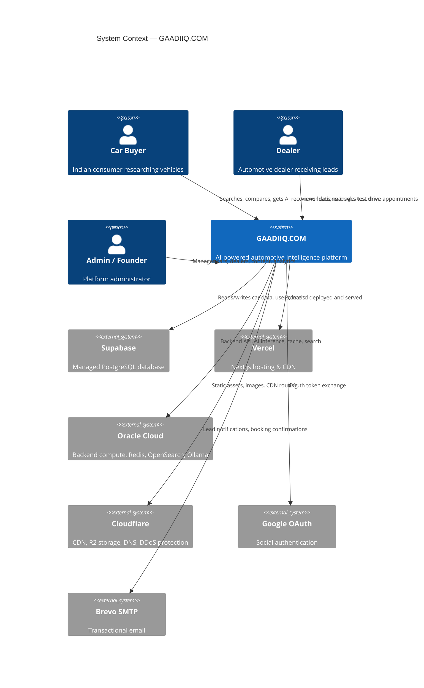
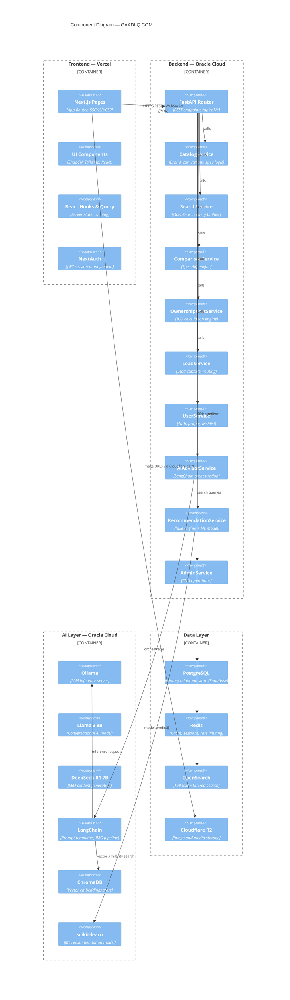
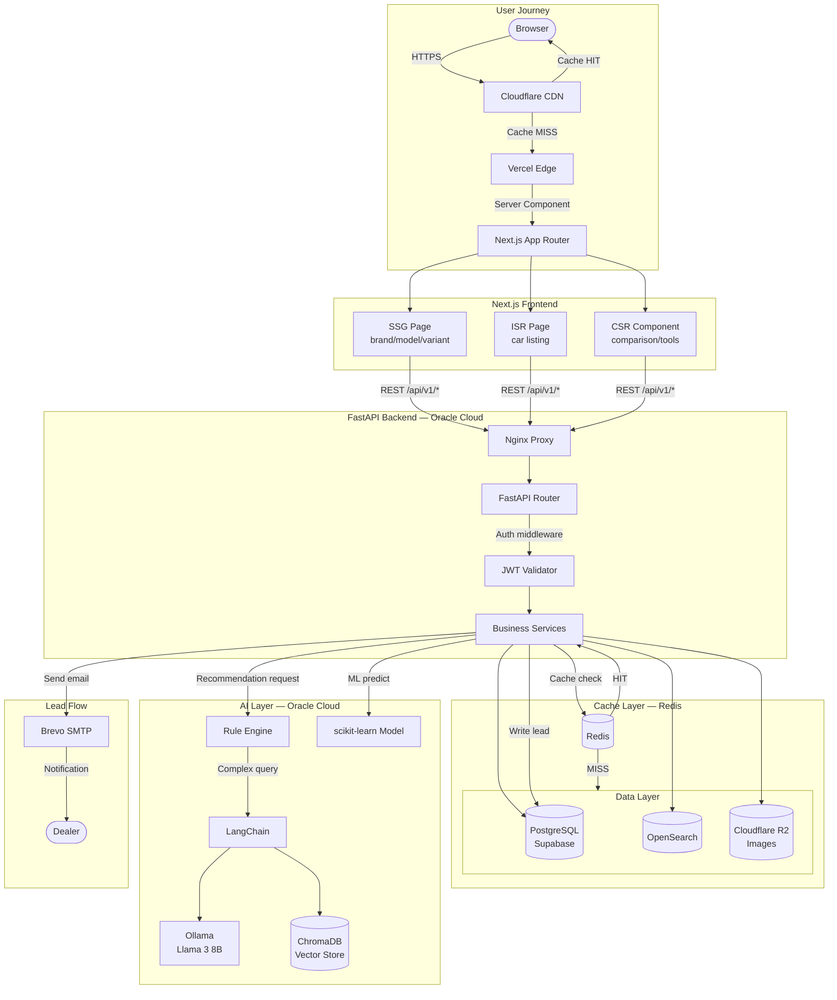
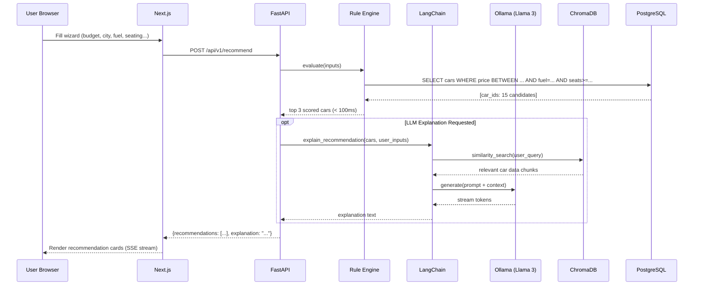

# GAADIIQ.COM — Architecture Diagrams

**Version:** 1.0  
**Date:** 2026-06-24

All diagrams use Mermaid syntax (renders in GitHub, Notion, and VS Code with Mermaid extension).

---

## 1. System Context Diagram



---

## 2. Component Diagram



---

## 3. Data Flow Diagram



---

## 4. User Interaction Sequence — AI Advisor



---

## 5. Deployment Architecture (Text Representation)

```
┌─────────────────────────────────────────────────────────────────┐
│                         INTERNET                                │
└──────────────────────────┬──────────────────────────────────────┘
                           │
                  ┌────────▼────────┐
                  │   Cloudflare    │  DNS + CDN + DDoS + R2
                  │  (Free Tier)    │  Storage
                  └────────┬────────┘
                           │
          ┌────────────────┼────────────────────┐
          │                │                    │
  ┌───────▼──────┐  ┌──────▼──────┐   ┌────────▼──────┐
  │    Vercel    │  │   GitHub    │   │  Oracle Cloud  │
  │  (Free Tier) │  │  (Actions)  │   │  Always Free   │
  │              │  │  CI/CD      │   │  ARM VM        │
  │  Next.js 14  │  └─────────────┘   │  4 OCPUs 24GB  │
  │  App Router  │                    │                │
  │  TypeScript  │                    │  ┌───────────┐ │
  │  Tailwind    │                    │  │  Nginx    │ │
  │  ShadCN UI   │◄───────────────────┤  │  Proxy    │ │
  └──────────────┘   API calls HTTPS  │  └─────┬─────┘ │
                                      │        │       │
                                      │  ┌─────▼─────┐ │
                                      │  │  FastAPI  │ │
                                      │  │  Python   │ │
                                      │  └─────┬─────┘ │
                                      │        │       │
                              ┌───────┴──┬─────┴──┬────┴──────┐
                              │          │        │           │
                        ┌─────▼──┐ ┌────▼───┐ ┌──▼──────┐ ┌──▼────┐
                        │ Redis  │ │OpenSrch│ │ Ollama  │ │Prom + │
                        │ Cache  │ │ Search │ │+LangChn │ │Grafana│
                        └────────┘ └────────┘ │+ChromaDB│ │ Loki  │
                                              └─────────┘ └───────┘
                              │
                     ┌────────▼────────┐
                     │    Supabase     │
                     │  (Free Tier)    │
                     │  PostgreSQL 16  │
                     └─────────────────┘
```

---

*Part of Phase 1 HLD. See: [HLD.md](HLD.md) | [DeploymentDiagram.md](DeploymentDiagram.md) | [SecurityArchitecture.md](SecurityArchitecture.md)*
