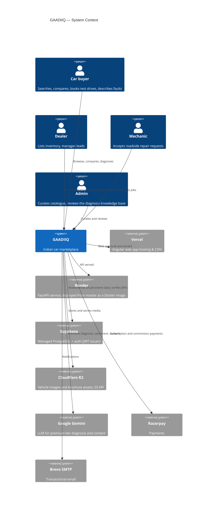
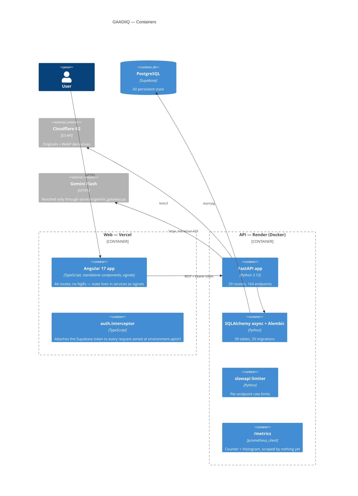
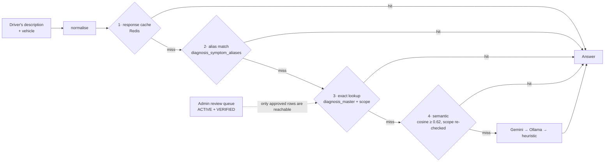

# GAADIIQ.COM — Architecture Diagram

**Version:** 2.0
**Date:** 2026-08-14
**Status:** As-built. Every component below was verified against the code and
`render.yaml` on the date above, not against the original design.

> **What changed from v1.0.** The first version described a design that was
> never built: a Next.js frontend and a single Oracle Cloud host running the
> API, Redis, OpenSearch and Ollama. The frontend is Angular 17 and the API
> runs on Render. Section 5 lists the services that are configured in code but
> have no endpoint set in production — those are the parts that quietly fall
> back rather than fail, and they are the reason the old diagram looked right.

---

## 1. System Context

**Not in the picture, deliberately:** Oracle Cloud and Railway. Neither hosts
anything. The Oracle deploy job was removed from `.github/workflows/ci-api.yml`
after it was found to have never run — it was gated on a `main` branch that does
not exist in this repository.

---

## 2. Containers

**One rule worth repeating here** because it has been broken twice: the Angular
`auth.interceptor` attaches the Supabase token to every request aimed at
`environment.apiUrl`. Setting an `Authorization` header by hand shadows it.

---

## 3. AI Diagnosis — the answer path

This is the part of the system with the most moving pieces, so it gets its own
view. Cheapest first; the model is the last resort, not the first step.

Two properties the diagram encodes rather than states:

- **A row is served only when `status = ACTIVE` and `verification_status =
  VERIFIED`.** Rows marked `AI_GENERATED` are forced to `PENDING_REVIEW` on
  import regardless of what the file says.
- **Similarity ranks; vehicle scope decides.** The semantic rung re-applies the
  same manufacturer / model / fuel / year / odometer predicates as the exact
  rung. Without that it served a Tata Nexon row to a Maruti Swift.

---

## 4. Data stores

| Store | What it holds | Where |
|---|---|---|
| PostgreSQL | 39 tables — catalogue, listings, users, dealers, mechanics, loans, diagnosis KB | Supabase |
| Cloudflare R2 | Vehicle images, WebP derivatives, brochure pages | S3-compatible |
| Redis | OTP digests, diagnosis response cache | See §5 — **not configured in production** |
| Qdrant | Listing vectors for semantic listing search | See §5 |
| OpenSearch | Listing full-text index | See §5 |

**Schema lives in two places.** 33 Alembic migrations *and* seven hand-run
`schema_setup_batch*.sql` files at the repo root. Some marketplace and loan
tables exist only in the SQL files, so shipping code that needs them does not
ship the tables. Check both.

---

## 5. Configured in code, absent in production

Every service in this table degrades silently rather than failing. That is
deliberate, and it is also why this document previously described infrastructure
that was not running. `render.yaml` sets none of these variables.

| Service | Env var | What happens without it |
|---|---|---|
| Redis | `REDIS_URL` | OTP digests and the diagnosis cache fall back to a per-process dict. Correct, but not shared across workers or restarts. |
| Ollama | `OLLAMA_BASE_URL` | Defaults to `localhost:11434`, unreachable on Render. Free-tier diagnosis therefore lands on the heuristic fallback unless the knowledge base answers. |
| OpenSearch | `OPENSEARCH_URL` | `services/search_index.py` probes once and falls back to Postgres `LIKE` search. |
| Qdrant | `QDRANT_URL` | Vector listing search is skipped. |
| KYC pepper | `KYC_HASH_PEPPER` | Aadhaar and OTP digests are computed unpeppered. Config refuses to boot without it **only** when `MARKETPLACE_ENABLED` is on. |

These are findings, not recommendations — whether to provision them is a product
decision. What matters is that the previous version of this document presented
them as running.

---

## 6. Cross-cutting

- **Auth.** Supabase issues the JWT; the API verifies it against Supabase's
  JWKS (`services/llm_tier.py`, `core/dependencies.py`). Tier — free vs premium
  — is resolved from the verified token, never from the request body.
- **Rate limiting.** `slowapi`, per endpoint. `/diagnosis/analyse` is 5/min and
  20/hour and needs no authentication.
- **Metrics.** `prometheus_client` exposes `/metrics` from `main.py`. There is
  no Prometheus, Grafana, Loki or Alertmanager in this repository — see
  `MonitoringArchitecture.md`, which describes an intended stack.
- **Sensitive data.** Aadhaar is validated and then discarded; only a peppered
  SHA-256 digest and the last four digits survive. PAN is stored but never
  returned — every response carries `ABCDE****F`. No credit score is ever
  invented: `services/credit_bureau.py::fetch_score` raises rather than
  returning a plausible number.
