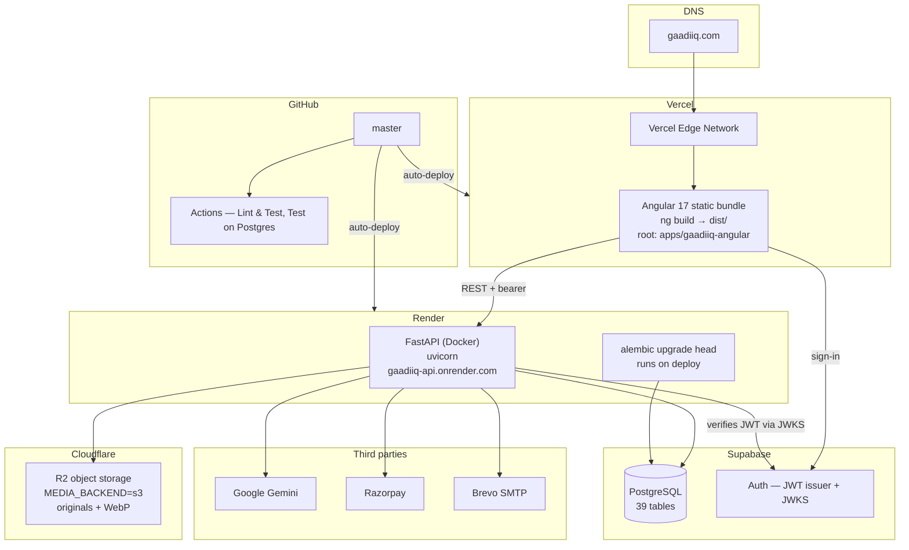

# GAADIIQ.COM — Deployment Diagram

**Version:** 2.0
**Date:** 2026-08-14
**Status:** As-built, verified against `render.yaml`, `vercel.json`, the Angular
project config and `.github/workflows/` on the date above.

> **What changed from v1.0.** The previous version deployed the API to an Oracle
> Cloud ARM VM running Docker Compose with Nginx, Redis, OpenSearch, Ollama,
> ChromaDB, Prometheus, Grafana and Loki, fronted by Cloudflare WAF at
> `api.gaadiiq.com`. None of that is running. The API is a Docker service on
> Render; the web app is a static Angular bundle on Vercel. There is also no
> `main` branch — everything deploys from `master`.

---

## 1. Environments

| Environment | Purpose | Infrastructure |
|---|---|---|
| `local` | Developer machine | `ng serve` + `uvicorn` + local Postgres. SQLite is the default for tests. |
| `production` | Live | Vercel (web) + Render (API) + Supabase (Postgres) + Cloudflare R2 (media) |

There is no separate staging environment on its own infrastructure. Vercel
builds a preview deployment per pull request; the API has no equivalent, so an
API change is verified by CI and then by production. See `docs/STAGING.md`.

---

## 2. Production topology



---

## 3. Deploy triggers

| Target | Trigger | What runs |
|---|---|---|
| Vercel | push to `master`; preview per PR | `ng build`, static upload |
| Render | push to `master` | Docker build, then `alembic upgrade head`, then uvicorn |
| GitHub Actions | push / PR touching `apps/api/**` | `ruff check .`, pytest on SQLite, pytest + migrations on Postgres 16 |

**There is no deploy job in GitHub Actions.** Render and Vercel each watch
`master` themselves. A `Deploy to Oracle Cloud` job existed until 2026-08-14; it
had never run, because it was gated on `github.ref == 'refs/heads/main'` and
this repository has no `main` branch.

---

## 4. Migrations at deploy time

Render runs `alembic upgrade head` on every deploy. Two things follow from that:

- **A broken migration is a failed deploy, not a failed test run.** CI's
  `Test on Postgres` job applies the whole chain to an empty Postgres 16 for
  exactly this reason, and compares the migrated schema against the models.
- **Migrations are not the whole schema.** Seven `schema_setup_batch*.sql` files
  at the repo root were run by hand and are not in the Alembic chain. Some
  marketplace and loan tables exist only there. Shipping code that needs one of
  those tables does not ship the table.

---

## 5. Configuration

`render.yaml` declares these, all as `sync: false` (set in the Render dashboard,
not in the repo):

```
ALLOWED_ORIGINS  DATABASE_URL  SUPABASE_JWT_SECRET  SUPABASE_URL
ADMIN_EMAILS  SECRET_KEY  GEMINI_API_KEY
MEDIA_BACKEND=s3  R2_ENDPOINT_URL  R2_ACCESS_KEY_ID  R2_SECRET_ACCESS_KEY
R2_BUCKET_NAME  R2_PUBLIC_URL
RAZORPAY_KEY_ID  RAZORPAY_KEY_SECRET
ENVIRONMENT=production
```

**Declared nowhere, and therefore unset in production:**

| Variable | Consequence |
|---|---|
| `REDIS_URL` | OTP digests and the diagnosis response cache use a per-process dict. Not shared across workers or restarts. |
| `OLLAMA_BASE_URL` | Defaults to `localhost:11434`, unreachable on Render. Free-tier diagnosis falls back to the heuristic path. |
| `OPENSEARCH_URL` | Search falls back to Postgres. |
| `QDRANT_URL` | Vector listing search is skipped. |
| `KYC_HASH_PEPPER` | Digests are computed unpeppered. Startup refuses to boot without it **only** when `MARKETPLACE_ENABLED` is on. |

Each of these degrades quietly by design. That is why the previous version of
this document could describe them as deployed for months without anything
visibly breaking.

---

## 6. Not used

**Oracle Cloud**, **Railway**, **Nginx**, **Docker Compose in production**,
**ChromaDB**, **Prometheus/Grafana/Loki as deployed services**. All appeared in
v1.0. None of them host or run anything today. `prometheus_client` is a library
dependency and does expose `/metrics` from the API — nothing scrapes it.
