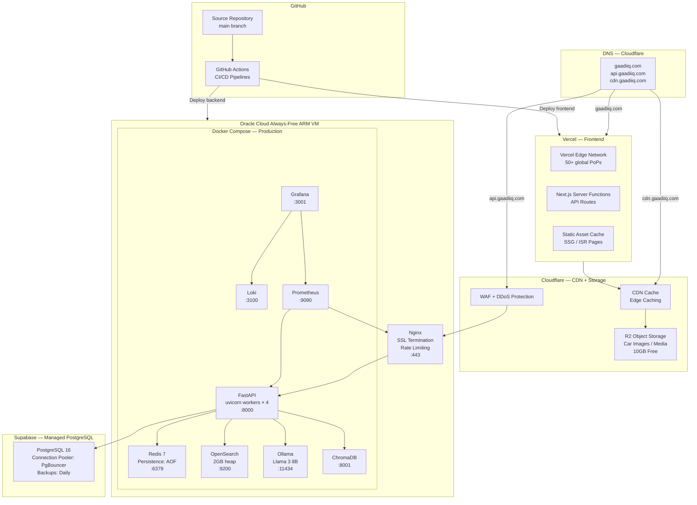
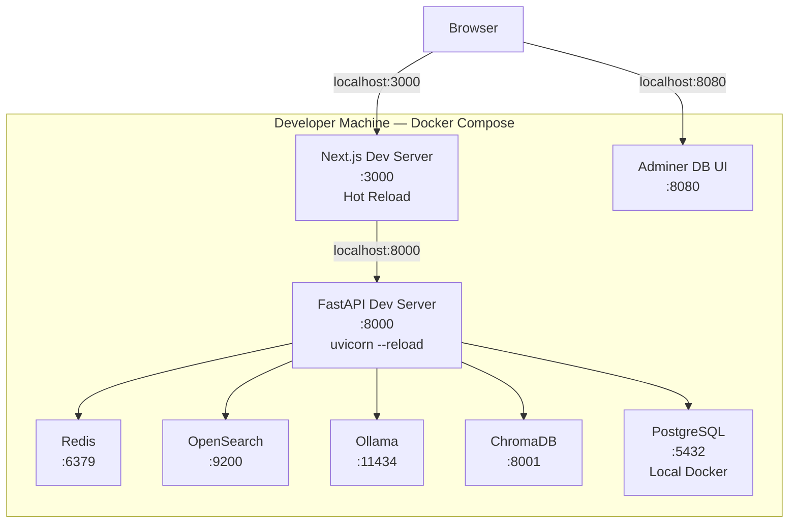
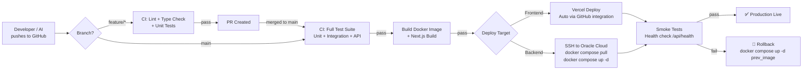

# GAADIIQ.COM — Deployment Diagram

**Version:** 1.0  
**Date:** 2026-06-24

---

## 1. Environment Overview

| Environment | Purpose | Infrastructure |
|---|---|---|
| `local` | Developer machine | Docker Compose (all services) |
| `staging` | Pre-prod validation | Oracle Cloud (same VM, different port) |
| `production` | Live platform | Vercel + Oracle Cloud + Supabase + Cloudflare |

---

## 2. Production Deployment Diagram



---

## 3. Local Development Deployment



---

## 4. CI/CD Pipeline



---

## 5. Docker Container Map

| Container | Image | CPU Limit | Memory Limit | Persistent Volume |
|---|---|---|---|---|
| `gaadiiq-api` | `python:3.12-slim` + app | 2 CPU | 4GB | `./logs` |
| `gaadiiq-redis` | `redis:7-alpine` | 0.5 CPU | 512MB | `redis-data` |
| `gaadiiq-opensearch` | `opensearchproject/opensearch:2` | 1 CPU | 2GB | `os-data` |
| `gaadiiq-ollama` | `ollama/ollama` | 2 CPU | 8GB | `ollama-models` |
| `gaadiiq-chromadb` | `chromadb/chroma` | 0.5 CPU | 1GB | `chroma-data` |
| `gaadiiq-prometheus` | `prom/prometheus` | 0.25 CPU | 256MB | `prom-data` |
| `gaadiiq-grafana` | `grafana/grafana` | 0.25 CPU | 256MB | `grafana-data` |
| `gaadiiq-loki` | `grafana/loki` | 0.25 CPU | 256MB | `loki-data` |
| `gaadiiq-nginx` | `nginx:alpine` | 0.25 CPU | 128MB | — |

**Total:** ~7 CPU, ~16.5GB RAM — within Oracle Free Tier (4 OCPUs, 24GB).  
Note: Ollama and API share CPU; Ollama only active during AI inference requests.

---

## 6. Network Architecture

```
Public Internet
    │
    ▼
Cloudflare WAF (DDoS, bot protection)
    │
    ▼
Oracle Cloud VM — Public IP
    │
Nginx (:443) — SSL termination
    │  └── Certbot / Let's Encrypt (free SSL)
    │
    ├──► FastAPI (:8000) — internal Docker network only
    │
    └── Firewall Rules (OCI Security List):
          Inbound:  80 (redirect), 443 (HTTPS), 22 (SSH — key-only)
          Outbound: All
          Internal: All containers communicate on gaadiiq-network bridge
```

---

## 7. Secrets & Configuration

| Secret | Storage | Access Method |
|---|---|---|
| DATABASE_URL (Supabase) | GitHub Actions Secret | Injected as env var at deploy time |
| JWT_SECRET_KEY | GitHub Actions Secret | Docker env |
| REDIS_PASSWORD | GitHub Actions Secret | Docker env |
| Google OAuth Client ID/Secret | GitHub Actions Secret | Docker env |
| Cloudflare R2 Access Key | GitHub Actions Secret | Docker env |
| SMTP API Key (Brevo) | GitHub Actions Secret | Docker env |
| Oracle SSH Private Key | GitHub Actions Secret | Used for deployment only |

All secrets encrypted at rest in GitHub Actions. No secrets in source code or Docker images.

---

*Part of Phase 1 HLD. See: [HLD.md](HLD.md) | [ArchitectureDiagram.md](ArchitectureDiagram.md) | [SecurityArchitecture.md](SecurityArchitecture.md)*
