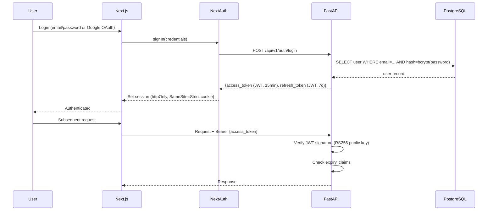

# GAADIIQ.COM — Security Architecture

**Version:** 1.0  
**Date:** 2026-06-24  
**Compliance Target:** OWASP Top 10 · DPDP Act 2023 (India)

---

## 1. Security Principles

1. **Defence in depth** — Multiple independent security layers.
2. **Least privilege** — Every service has minimum required permissions.
3. **Zero trust** — No implicit trust between internal services.
4. **Fail secure** — On error, deny access; do not expose internals.
5. **Privacy by design** — Collect minimum PII; no PII sold to third parties.

---

## 2. Threat Model

| Threat | Vector | Mitigation |
|---|---|---|
| SQL Injection | User input in queries | SQLAlchemy ORM (parameterised queries only) |
| XSS | Rendered user content | React escapes by default; DOMPurify for rich text |
| CSRF | State-changing requests | SameSite=Strict cookies; CSRF token on forms |
| Auth bypass | JWT tampering | RS256 algorithm; key rotation; short expiry |
| API abuse | Automated scrapers | Rate limiting (Nginx); bot scoring (Cloudflare) |
| DDoS | High-volume requests | Cloudflare DDoS mitigation (free tier) |
| Data exfiltration | Compromised API | Row-level access control; no bulk export endpoints |
| Credential stuffing | Brute-force login | Rate limit on /auth endpoints; CAPTCHA on login |
| Supply chain attack | Malicious packages | Dependency scanning (Dependabot); lockfiles pinned |
| Prompt injection | LLM input | System prompt hardening; input sanitisation before LLM |

---

## 3. Authentication & Authorisation

### 3.1 Authentication Flow



### 3.2 JWT Design

| Claim | Value | Purpose |
|---|---|---|
| `sub` | user UUID | User identifier |
| `role` | user/admin/dealer | RBAC |
| `iat` | Unix timestamp | Issued at |
| `exp` | iat + 900 (15min) | Expiry |
| `jti` | UUID | Token ID (revocation list) |

- Algorithm: **RS256** (asymmetric) — private key signs, public key verifies
- Access token TTL: **15 minutes**
- Refresh token TTL: **7 days** (stored in DB, revocable)
- Cookie flags: `HttpOnly`, `Secure`, `SameSite=Strict`

### 3.3 Role-Based Access Control (RBAC)

| Role | Permissions |
|---|---|
| `anonymous` | View cars, search, compare, use calculators |
| `user` | + Shortlist, book test drive, view lead status |
| `dealer` | + View own leads, manage test drives |
| `admin` | Full access to all resources |

---

## 4. Network Security

### 4.1 Perimeter Security

```
Internet
  │
  ▼
Cloudflare (Layer 7 WAF)
  Rules: Block known bad IPs, OWASP ruleset, bot challenge
  Rate limit: 100 req/10s per IP to API routes
  │
  ▼
Oracle Cloud Security List (Firewall)
  Inbound:  TCP 443 (HTTPS), TCP 80 (redirect to 443), TCP 22 (SSH — key-only, from admin IP)
  Outbound: Unrestricted (for updates, SMTP, Supabase)
  │
  ▼
Nginx (Application Layer)
  Rate limit: 100 req/min unauthenticated, 500 req/min authenticated
  Hide server version: server_tokens off
  Security headers (see §4.2)
  │
  ▼
FastAPI (Application)
  Input validation: Pydantic (all request bodies)
  Auth middleware: JWT verification on protected routes
```

### 4.2 HTTP Security Headers

All responses from Nginx include:

```nginx
add_header Strict-Transport-Security "max-age=31536000; includeSubDomains" always;
add_header X-Frame-Options "DENY" always;
add_header X-Content-Type-Options "nosniff" always;
add_header Referrer-Policy "strict-origin-when-cross-origin" always;
add_header Content-Security-Policy "default-src 'self'; img-src 'self' cdn.gaadiiq.com; script-src 'self'; style-src 'self' 'unsafe-inline'; connect-src 'self' api.gaadiiq.com;" always;
add_header Permissions-Policy "camera=(), microphone=(), geolocation=(self)" always;
```

---

## 5. Data Security

### 5.1 Data Classification

| Classification | Examples | Storage | Encryption |
|---|---|---|---|
| Public | Car specs, prices, reviews | PostgreSQL | In transit (TLS) |
| Internal | Analytics, lead aggregates | PostgreSQL | In transit (TLS) |
| Sensitive | User email, phone, name | PostgreSQL | At rest (Supabase AES-256) + in transit |
| Highly Sensitive | Passwords, tokens | PostgreSQL | bcrypt (cost 12) + AES-256 |

### 5.2 PII Handling (DPDP Act 2023 Compliance)

| Requirement | Implementation |
|---|---|
| Consent before collection | Consent checkbox on registration + lead forms |
| Purpose limitation | PII used only for service delivery; no ad targeting |
| Data minimisation | Collect only: name, email, phone, city, car interest |
| Right to access | `/api/v1/user/me` returns all stored PII |
| Right to erasure | `/api/v1/user/delete` — hard delete PII, anonymise lead records |
| Data retention | User PII: until account deleted. Lead data: 2 years. Logs: 90 days |
| Third-party sharing | Only dealer (for lead they paid for); no data brokers |

### 5.3 Database Security

- Supabase: Row Level Security (RLS) enabled on all user tables
- Application connects via SSL (`?sslmode=require`)
- Separate read-only DB user for analytics queries
- No direct DB access from frontend (only via API)
- Automated daily backups (Supabase free tier: 7-day retention)

---

## 6. Application Security

### 6.1 OWASP Top 10 Controls

| OWASP Risk | Control |
|---|---|
| A01 Broken Access Control | RBAC on all endpoints; ownership checks on user resources |
| A02 Cryptographic Failures | TLS 1.2+ everywhere; bcrypt passwords; RS256 JWT |
| A03 Injection | SQLAlchemy ORM only; Pydantic input validation; parameterised queries |
| A04 Insecure Design | Threat modelling this document; secure defaults |
| A05 Security Misconfiguration | Nginx hardened config; Docker non-root user; secrets in env vars |
| A06 Vulnerable Components | Dependabot; monthly `pip audit`; `npm audit` in CI |
| A07 Auth Failures | Short JWT TTL; refresh token rotation; lockout after 5 failures |
| A08 Software Integrity | GitHub Actions signed commits; pinned Docker image digests |
| A09 Logging Failures | All auth events and errors logged to Loki; 90-day retention |
| A10 SSRF | No user-controlled URL fetching; allowlist for external requests |

### 6.2 LLM-Specific Security (Prompt Injection)

- System prompt is fixed and not interpolated with user input
- User input is sanitised (strip HTML, truncate at 1,000 chars) before LLM
- LLM output is sanitised before rendering (strip HTML)
- Ollama runs on internal Docker network — not accessible from outside
- Rate limit AI advisor: 10 requests/hour per unauthenticated user

---

## 7. Infrastructure Security

### 7.1 Oracle Cloud VM Hardening

- SSH: key-based only; password auth disabled; non-standard port (optional)
- Automatic security updates: `unattended-upgrades` enabled
- Docker: containers run as non-root user (UID 1000)
- Secrets: environment variables only; no `.env` files in containers
- File system: Application directory read-only in containers

### 7.2 Supply Chain Security

- All dependencies pinned to exact versions in `requirements.txt` and `package-lock.json`
- GitHub Dependabot configured for automated dependency PRs
- `pip audit` and `npm audit` run in CI pipeline — fail on CRITICAL/HIGH
- Docker images pulled from official registries only; digest-pinned in Compose

---

## 8. Security Incident Response

| Severity | Examples | Response Time | Owner |
|---|---|---|---|
| Critical | Data breach, auth bypass | 1 hour | Founder |
| High | XSS in production, rate limit bypass | 4 hours | Founder |
| Medium | Dependency CVE, misconfiguration | 24 hours | Automated + Founder |
| Low | Log anomaly, slow response | 72 hours | Monitor |

**Breach response steps:**
1. Isolate: Block source IP via Cloudflare
2. Assess: Review Loki logs for scope
3. Contain: Rotate compromised credentials
4. Notify: Inform affected users (DPDP Act requires 72-hour notification)
5. Fix: Patch and redeploy
6. Report: Document RCA

---

*Part of Phase 1 HLD. See: [HLD.md](HLD.md) | [MonitoringArchitecture.md](MonitoringArchitecture.md)*
