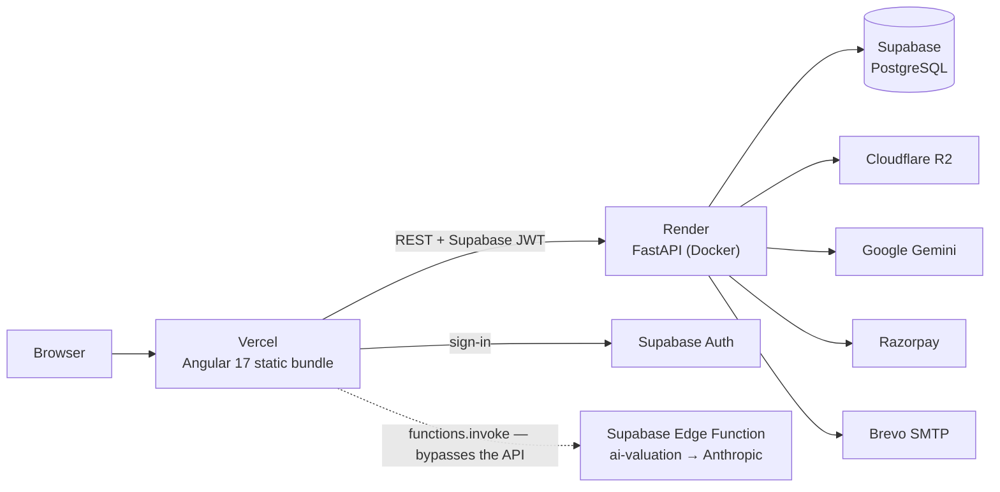

# GAADIIQ — System Overview (as built)

**Version:** 1.0
**Date:** 2026-08-14
**Method:** every statement below was read off the code, `render.yaml`,
`vercel.json`, `docker-compose.yml` and `.github/workflows/` on the date above.
Where something could not be verified, it says so.

This document exists because the 2026-06-24 HLD/LLD set described a system that
was largely not built, and correcting it in place left no single page you could
read to know what actually runs. **Start here.** The older documents are still
useful for intent and are cross-referenced throughout.

---

## 1. What the system is

An Indian car marketplace with five distinct surfaces, all served by one API:

| Surface | Who uses it | Where the logic lives |
|---|---|---|
| **Catalogue & listings** | Buyers | `routers/cars.py`, `listings.py`, `search.py` |
| **Buying tools** — EMI, TCO, EV, resale, valuation | Buyers | `routers/loans.py`, `resale.py`, `services/valuation.py` |
| **AI diagnosis** | Drivers with a fault | `routers/diagnosis.py`, `diagnosis_kb.py` + 4 services |
| **Roadside repair marketplace** | Drivers + mechanics | `routers/service_requests.py`, `mechanics.py` |
| **Car loans** | Buyers + lenders | `routers/loan_applications.py`, `services/loan_offers.py` |

Plus a dealer/seller side (listings, leads, sentiment, analytics) and an admin
side (catalogue curation, brochure ingestion, media, KB review).

**Scale of the codebase, measured:** 47 API services, 28 routers,
**164 endpoints**, 39 ORM tables, 418 test functions across 57 files;
34 Angular services, 43 page components, 44 routes.

---

## 2. Deployment shape



Both Vercel and Render deploy from `master`. There is no CI deploy job; each
platform watches the branch itself. Render runs `alembic upgrade head` on every
deploy.

**Not used, despite appearing in older documents:** Oracle Cloud, Railway,
Nginx, Docker Compose in production, ChromaDB, DeepSeek, Prometheus/Grafana/Loki
as running services.

---

## 3. The findings that matter

These are the gaps a reader of the old documents would not have seen. Each is
verifiable from the file named.

### 3.1 Schema lives in **four** places, not one

| Source | Count | Applied by |
|---|---|---|
| `apps/api/alembic/versions/` | 33 migrations | Render, on every deploy |
| `schema_setup_batch*.sql` (repo root) | 7 files | By hand, once |
| `supabase/migrations/*.sql` | 6 files | Supabase CLI / by hand |
| `apps/api/models/*.py` | 39 tables | The ORM's own view |

Only the first is automatic. Some marketplace and loan tables exist only in the
batch SQL, so shipping code that needs them does not ship the tables. The
`supabase/migrations` set (reviews, brands, analytics, test-drive requests) is a
third lineage that the API's own migration chain knows nothing about.

`cars.id` is a **UUID** in the ORM and `bigint` in batch 1. The ORM wins.

### 3.2 A second AI path bypasses the API entirely

`apps/gaadiiq-angular/src/app/pages/list-car/list-car.component.ts:250` calls
`supabase.client.functions.invoke('ai-valuation')` directly from the browser.
That Edge Function (`supabase/functions/ai-valuation/index.ts`) calls
**Anthropic** with `ANTHROPIC_API_KEY`.

So there are **three** LLM providers and **two** independent AI paths:

```
  Browser → FastAPI → gemini_gateway → Google Gemini        (documented)
  Browser → Supabase Edge Function → Anthropic              (undocumented)
```

The second path bypasses the gateway, and with it the timeout, the 429 retry,
the model choice and any record that a call happened. It has an 8-second
timeout and falls back to a shared client-side heuristic
(`utils/valuation-engine.ts`), so a failure is invisible.

This is worth a decision rather than a note: it contradicts the intended
"UI → API → gateway → model" rule, and it is a second API key in a second place.

### 3.3 74 of 91 settings are unset in production

`core/config.py` declares **91** settings. `render.yaml` sets **17**. The
notable absentees, and what each silently changes:

| Unset | Consequence |
|---|---|
| `REDIS_URL` | OTP digests and the diagnosis cache use a per-process dict — not shared across workers or restarts |
| `OLLAMA_BASE_URL` / `OLLAMA_URL` | Defaults to `localhost:11434`. **The entire Ollama tier is unreachable**: free-tier diagnosis, vision (`services/vision.py`), valuation and sentiment all lose their model |
| `KYC_HASH_PEPPER` | Aadhaar and OTP digests computed **unpeppered** |
| `OPENSEARCH_URL` | Listing search falls back to Postgres `LIKE` |
| `QDRANT_URL` + `SEMANTIC_SEARCH_ENABLED` | Vector listing search skipped |
| `STT_PROVIDER` / `TTS_PROVIDER` | Default `"none"` — voice diagnosis has no speech engine |
| `WHATSAPP_API_TOKEN`, `UPI_PAYEE_VPA` | Receipt delivery and scan-to-pay inert |
| `SMTP_HOST` | Transactional email inert |
| `MARKETPLACE_ENABLED` | Defaults `False` — **the whole roadside repair marketplace is off** |
| `ENABLE_EMBEDDINGS`, `ENABLE_OCR`, `ENABLE_SAFETY_DETECTION`, `MEDIA_CLASSIFICATION_ENABLED` | Default `False` — the WAVE 3 media ML pipeline is off |

Every one of these degrades quietly by design. That is the right behaviour for
resilience and it is exactly why documentation drifted: nothing breaks visibly
when a subsystem is switched off.

**Two of these are decisions, not observations:** the marketplace is built,
tested and off; and the KYC pepper being absent means the Aadhaar protection
described in `CLAUDE.md` is weaker in production than in design.

### 3.4 CI is narrower than it looks

- **Playwright runs in CI for `desktop-chrome` only.**
  `.github/workflows/ci-web.yml` installs Chromium and runs the project on any
  change under `apps/gaadiiq-angular/**`. `mobile-layout.spec.ts` and its three
  device projects are still manual. CI starts no API, so backend-dependent
  specs must skip.
- Every Playwright project declares a `testMatch`. A new spec matching no
  pattern runs nowhere and reports nothing — indistinguishable from passing.
- **12 test files are excluded from the Postgres job.** They fail there because
  the tests lean on SQLite's leniency (no FK enforcement; a failed statement not
  aborting the transaction), not because the product is wrong. 418 test
  functions exist; the Postgres job guards fewer.
- Test classes must be named `Test*Suite` or `Test*Case` (`pyproject.toml`).
  Anything else collects **zero tests** and passes silently.

### 3.5 Two undocumented codebases in the repo

- **`carlytics/`** — a separate static site ("Carlytics — AI-Powered Car
  Analytics"), HTML/CSS/JS, not in the npm workspaces, not deployed by any
  config in this repo. Referenced only by `README.md`.
- **`supabase/functions/ai-valuation/`** — see §3.2.

Neither appears in any HLD or LLD document.

---

## 4. Frontend, precisely

Angular 17, standalone components, **signals throughout** — 283 `signal(` and
155 `computed(` calls against 19 `Observable<` declarations. There is no store
library.

The rule that has cost time twice: `computed()` tracks **signal reads only**. A
`computed()` over a plain field bound with `ngModel` evaluates once and reports
a stale answer forever. Use a method.

`interceptors/auth.interceptor.ts` attaches the Supabase token to every request
aimed at `environment.apiUrl`. **Never set `Authorization` manually** — it
shadows the interceptor.

Full detail: `LLD/UIArchitecture.md`.

---

## 5. AI, precisely

Three providers, and only one of them answers a diagnosis request today.

| Provider | Reached via | Status |
|---|---|---|
| **Google Gemini** (`gemini-3.5-flash-lite`) | `services/gemini_gateway.py` | **Working.** `GEMINI_API_KEY` is set. Premium diagnosis, brochure ingestion, variant research, resale forecast |
| **Anthropic** | Supabase Edge Function, from the browser | Working, and outside the API |
| **Ollama** (llama3, llava) | direct `httpx` from 4 services | **Unreachable** — no host configured |

For diagnosis specifically the model is the *last* step:

```
cache → alias → exact lookup → semantic → Gemini → Ollama → heuristic
```

A row reaches a driver only when `status = ACTIVE` **and**
`verification_status = VERIFIED`, both set by a human through the review queue.
`AI_GENERATED` rows are forced to `PENDING_REVIEW` on import — a model cannot
promote its own output. Full detail: `LLD/AIArchitecture.md` §0.

---

## 6. Sensitive data — the rules in force

- **Aadhaar is never stored.** Validated (Verhoeff), then only a peppered
  SHA-256 digest and the last four digits survive. Aadhaar Act s.29(4) makes
  storing the number an offence for a private entity. *See §3.3 — the pepper is
  not set in production.*
- **PAN is stored** — a lender cannot act on a hash — **but never returned.**
  Every response carries `ABCDE****F`.
- **No credit score is ever invented.** `services/credit_bureau.py::fetch_score`
  raises rather than returning a plausible number, because a generated score is
  indistinguishable from a real one at the call site.
- **The Gemini API key never appears in a URL.** It goes as an `x-goog-api-key`
  header via the gateway. Five call sites previously put it in the query string.

---

## 7. Where to look next

| Question | Document |
|---|---|
| What runs where | `HLD/DeploymentDiagram.md` |
| Component and container view | `HLD/ArchitectureDiagram.md` |
| Every endpoint | `LLD/APIContracts.md` §1 (generated) |
| Every table | `LLD/DatabaseDesign.md` §1 (generated) |
| The web app | `LLD/UIArchitecture.md` |
| The AI ladder | `LLD/AIArchitecture.md` §0 |
| Known sharp edges with evidence | `docs/ENGINEERING_BACKLOG.md` |

Both generated sections are produced from the router decorators and the ORM, so
they cannot drift silently. Everything else in this set is prose and can.
