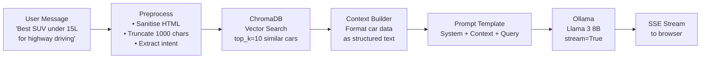

# GAADIIQ.COM — AI Architecture

**Version:** 2.0
**Date:** 2026-08-14
**Stack as built:** knowledge base (PostgreSQL) → Gemini Flash → Ollama → heuristic ·
fastembed (BAAI/bge-small-en-v1.5, 384-dim) · Qdrant · LangChain (sentiment only)

> **Corrected 2026-08-14.** Three components named in v1.0 do not exist in the
> codebase: **ChromaDB** (embeddings are fastembed + Qdrant), **DeepSeek R1 7B**
> (no reference anywhere), and the Oracle ARM inference host (never
> provisioned — `OLLAMA_BASE_URL` is unset in production, so the Ollama rung is
> unreachable and free-tier requests fall through to the heuristic). LangChain
> *is* a real dependency but is used in exactly one place,
> `services/sentiment.py`. Section 0 below describes the answer path that
> actually runs; the later sections are kept for the parts still accurate and
> are marked where they are not.

---

## 0. Diagnosis answer path (as built)

The most-used AI surface. Ordered cheapest first — a model is the last resort,
not the first step.

```
normalise
  → 1· response cache      Redis, keyed on question + vehicle + language
  → 2· alias match         diagnosis_symptom_aliases, an editor's mapping
  → 3· exact lookup        diagnosis_master, filtered by vehicle scope
  → 4· semantic            fastembed cosine ≥ 0.62, scope re-applied
  → Gemini Flash           premium tier, via services/gemini_gateway.py
  → Ollama                 unreachable in production today
  → heuristic fallback     rules over the 12-row repair_knowledge.json
```

**Three providers exist, and only one answers a diagnosis today:** Gemini
(working), Anthropic (via a Supabase Edge Function invoked from the browser,
outside the API entirely — see `HLD/SystemOverview.md` §3.2), and Ollama
(`OLLAMA_BASE_URL` unset, so vision, valuation, sentiment and the free diagnosis
tier all lose their model).

**Modules:** `services/diagnosis_kb_lookup.py`, `services/diagnosis_cache.py`,
`services/diagnosis_kb_review.py`, `services/diagnosis.py`,
`services/gemini_gateway.py`, `services/llm_tier.py`.

Four properties that are enforced in code rather than left to convention:

1. **A row reaches a driver only when `status = ACTIVE` and
   `verification_status = VERIFIED`.** Two independent gates, both set by a
   person through the review queue.
2. **`AI_GENERATED` rows are forced to `PENDING_REVIEW` on import**, whatever
   the source file claims. A model cannot promote its own output.
3. **Similarity ranks; vehicle scope decides.** The semantic rung re-applies the
   manufacturer / model / fuel / year / odometer predicates. Without it, it
   served a Tata Nexon row to a Maruti Swift.
4. **Safety-critical answers are never cached**, and `can_drive = UNKNOWN` maps
   to `safe_to_drive: false` — the response field is a boolean, and "we don't
   know" must not render as "safe".

**Tier resolution** (`services/llm_tier.py`) reads the caller's Supabase JWT and
verifies it against the JWKS. It is never read from the request body: doing so
would let a free user send a paid user's UUID and be upgraded.

---

## 1. AI Systems Overview

GAADIIQ has three distinct AI systems:

| System | Model | Purpose | Latency Target |
|---|---|---|---|
| **Rule Engine** | None (Python logic) | Fast baseline recommendations | < 100ms |
| **ML Recommender** | scikit-learn (content-based) | Personalised rankings | < 200ms |
| **Smart Advisor (LLM)** | Llama 3 8B via Ollama | Conversational AI, explanations | < 5s (streamed) |
| **SEO Content Generator** | DeepSeek R1 7B | Car page descriptions, FAQs | Offline batch |

All AI runs **self-hosted on Oracle Cloud VM** — zero API cost.

---

## 2. Rule Engine

The rule engine is the primary recommendation path — fast, deterministic, explainable.

### Algorithm

```python
def score_variant(variant: Variant, inputs: RecommendInputs) -> float:
    score = 0.0
    weights = {
        'price': 0.30,
        'safety': 0.20,
        'mileage': 0.15,
        'features': 0.15,
        'popularity': 0.10,
        'brand_preference': 0.10,
    }

    # Price score: closer to budget max = higher score
    price_ratio = variant.ex_showroom_price / inputs.budget_max
    if price_ratio <= 1.0:
        score += weights['price'] * (1 - (1 - price_ratio) * 0.5)

    # Safety score: NCAP rating / 5.0
    if variant.ncap_rating_bharat:
        score += weights['safety'] * (variant.ncap_rating_bharat / 5.0)

    # Mileage score: normalised within fuel type category
    score += weights['mileage'] * normalise_mileage(variant, inputs.fuel_preference)

    # Features score: count matching priority features
    score += weights['features'] * feature_match_ratio(variant, inputs)

    # Popularity score: normalised 0-1
    score += weights['popularity'] * (variant.car.popularity_score / 100.0)

    return round(score * 100, 1)  # 0-100 match score
```

### Explanation Generator

```python
def generate_reasons(variant, inputs, score) -> list[str]:
    reasons = []
    if variant.ex_showroom_price <= inputs.budget_max:
        on_road = estimate_on_road(variant, inputs.city)
        reasons.append(f"✓ Within budget (₹{format_price(on_road)} on-road in {inputs.city})")
    if variant.ncap_rating_bharat >= 4.0:
        reasons.append(f"✓ {variant.ncap_rating_bharat}-star Bharat NCAP safety rating")
    if inputs.usage_type == 'city' and variant.mileage_kmpl_city >= 15:
        reasons.append(f"✓ Good city mileage: {variant.mileage_kmpl_city} km/l")
    # ... 12 more reason generators
    return reasons[:4]  # Show top 4
```

---

## 3. ML Recommendation Engine

### Phase 1: Content-Based Filtering (MVP)

Uses car/variant feature vectors to find similar cars and rank by user preference alignment.

```python
# Feature vector per variant (normalised 0-1)
feature_vector = [
    price_normalised,           # 0-1 within category
    mileage_normalised,         # 0-1 within fuel type
    ncap_rating / 5.0,
    airbags_count / 10.0,
    boot_space_normalised,
    ground_clearance_normalised,
    power_normalised,
    is_petrol, is_diesel, is_electric,   # one-hot
    is_manual, is_automatic,              # one-hot
    is_hatchback, is_sedan, is_suv, is_muv,  # one-hot
    popularity_score / 100.0
]
```

**Similarity:** Cosine similarity between user preference vector and car feature vectors.

```python
from sklearn.metrics.pairwise import cosine_similarity

user_vector = build_user_vector(inputs)    # same shape as car vectors
car_matrix  = load_car_feature_matrix()   # precomputed at startup

scores = cosine_similarity([user_vector], car_matrix)[0]
top_indices = scores.argsort()[-10:][::-1]
```

### Phase 2: Collaborative Filtering (Post-MVP, 3 months after launch)

Once we have real user interaction data:
- **Implicit feedback signals:** car views, comparison adds, wishlist adds, leads submitted
- **Model:** Alternating Least Squares (ALS) matrix factorisation via `implicit` library
- **Training:** Nightly batch job; model serialised to disk; loaded at startup

### Model Lifecycle

```
Training (nightly, 2am IST):
  → Load interactions from PostgreSQL
  → Preprocess + build feature matrix
  → Fit model (sklearn / implicit)
  → Validate: holdout accuracy, coverage
  → Serialise to disk: /models/recommender_{date}.pkl
  → Update symlink: /models/recommender_latest.pkl
  → Reload in FastAPI (without restart)

Serving:
  → Load model at startup from /models/recommender_latest.pkl
  → In-memory inference (< 5ms per request)
  → Feature matrix cached in Redis on startup
```

---

## 4. Smart Advisor (LLM — Llama 3 8B)

### RAG Pipeline



### System Prompt

```python
SYSTEM_PROMPT = """You are GAADIIQ's AI car advisor for the Indian market.
Your role: help buyers find the right car based on their needs.

Rules:
- Only recommend cars from the provided context
- Always mention the car's price in lakhs (₹)
- Always mention Bharat NCAP rating if available
- Recommend maximum 3 cars per response
- Be concise: max 200 words per recommendation
- Always explain WHY you recommend each car
- If asked about unavailable cars, say "I don't have data on that model"
- Never make up specifications

Indian context:
- Fuel prices: Petrol ₹104/L, Diesel ₹93/L, CNG ₹75/kg (Delhi)
- Consider traffic: city driving needs lower gears, better AC
- Consider roads: ground clearance matters in many Indian cities
- Consider family structure: joint families often need 6-7 seaters

Today's date: {date}
"""

def build_prompt(user_message: str, context_cars: list, conversation_history: list) -> str:
    context = format_cars_as_text(context_cars)
    return f"{SYSTEM_PROMPT}\n\nAvailable cars:\n{context}\n\nConversation:\n{format_history(conversation_history)}\nUser: {user_message}\nAssistant:"
```

### Embedding Strategy

> **Corrected.** ChromaDB is not used. Embeddings come from **fastembed**
> (`BAAI/bge-small-en-v1.5`, 384 dimensions, `services/embeddings.py`) and
> listing vectors are stored in **Qdrant** (`services/vector_store.py`).
> `QDRANT_URL` is unset in production, so vector listing search is skipped
> there. The diagnosis KB keeps its vectors in process, rebuilt on a 5-minute
> TTL — the corpus is small enough that a round trip would cost more than it
> saves. The subsection below is the original ChromaDB plan and is retained
> only for the chunking rationale.

Each car variant is embedded as a structured text document:

```python
def car_to_document(car: Car, variant: Variant) -> str:
    return f"""
    Car: {car.name} ({variant.name})
    Brand: {car.brand.name}
    Body: {car.body_type}
    Price: ₹{variant.ex_showroom_price/100000:.1f} lakh (ex-showroom)
    Fuel: {variant.fuel_type}
    Transmission: {variant.transmission}
    Engine: {variant.engine_displacement_cc}cc, {variant.engine_power_bhp}bhp, {variant.engine_torque_nm}Nm
    Mileage: {variant.mileage_kmpl_arai} kmpl (ARAI)
    Seating: {variant.seating_capacity}
    Safety: {variant.ncap_rating_bharat or 'N/A'} star NCAP
    Boot: {variant.boot_space_litres}L
    Ground clearance: {variant.ground_clearance_mm}mm
    Key features: {', '.join(car.highlights or [])}
    Ideal for: {infer_ideal_use(variant)}
    """
```

Embeddings generated by: `nomic-embed-text` (via Ollama, free, 768-dim).  
Re-embedded on: each car add/update (triggered by admin action).

---

## 5. SEO Content Generator (DeepSeek R1 7B) — **not built**

> **Corrected.** There is no DeepSeek model and no SEO content generator in the
> codebase. This section describes an intention.

Used offline (admin-triggered or nightly batch) to generate:
- Car page meta descriptions
- "Expert summary" paragraphs
- FAQ sections (5 Q&As per car)
- Review summaries

```python
SEO_PROMPT = """Write SEO-optimised content for the {car_name} for an Indian audience.

Specs: {car_specs_summary}

Generate:
1. Meta description (155 chars max, include price and key feature)
2. Expert summary (100 words, highlight best features, ideal buyer)
3. 5 FAQs with answers (common Indian buyer questions about this car)

Tone: informative, honest, no superlatives. Indian English.
Output as JSON: {{"meta_description": "...", "summary": "...", "faqs": [...]}}
"""
```

Output stored in `cars.seo_description`, `cars.highlights`, and a `car_faqs` table.

---

## 6. Inference Infrastructure

### Ollama Configuration

```yaml
# /etc/ollama/config.yaml
models_path: /var/ollama/models
concurrent_requests: 4
gpu_layers: 0           # CPU-only on Oracle free tier ARM
num_threads: 4          # Use all 4 OCPUs
context_length: 4096
```

### Model Loading Strategy

| Time | Action |
|---|---|
| Server startup | Pull Llama 3 8B + DeepSeek R1 7B + nomic-embed-text (once, cached) |
| First request | Model warm (loaded in RAM) |
| Idle > 30 min | Model offloaded from RAM (Ollama auto-manages) |
| Next request | Model reloaded (~10s warm-up) |

### Performance Characteristics (Oracle ARM, no GPU) — **hardware never provisioned**

> **Corrected.** The numbers below were estimates for a host that does not
> exist. The one latency figure that has been measured on the current stack:
> a knowledge-base answer against Postgres returns in single-digit
> milliseconds, because it is two indexed queries and no model call.

| Task | Tokens/sec | Latency |
|---|---|---|
| Llama 3 8B inference | ~8 tok/s | ~3-8s for typical response |
| DeepSeek R1 7B inference | ~10 tok/s | ~2-5s |
| nomic-embed-text embedding | ~50 docs/s | ~20ms per doc |
| Rule engine recommendation | N/A | ~50-100ms |
| ML model inference (sklearn) | N/A | ~5ms |

**Fallback:** If Ollama is unavailable (cold start, OOM), the recommendation API falls back to the rule engine automatically. LLM explanations show: "AI advisor is warming up. Here are recommendations based on your inputs:"

---

## 7. AI Safety & Quality Controls

| Risk | Control |
|---|---|
| Hallucinated car specs | RAG context contains only real DB data; prompt instructs: "only use provided context" |
| Prompt injection | Input sanitised (strip HTML, special chars); system prompt not interpolatable |
| Offensive output | Llama 3 8B has built-in guardrails; output filtered for profanity |
| Wrong price quotes | Prices pulled from DB at query time; always marked "ex-showroom" |
| Rate limit abuse | 10 AI requests/hour per session (unauthenticated) |
| Context length overflow | Max user input: 1,000 chars; max conversation history: 5 turns |

---

## 8. AI Analytics

Every AI interaction is logged to `recommendations` table:

```json
{
  "session_id": "uuid",
  "engine_used": "llm",
  "llm_model": "llama3:8b",
  "latency_ms": 4200,
  "input_tokens": 850,
  "output_tokens": 320,
  "recommended_car_ids": ["uuid1", "uuid2", "uuid3"],
  "user_selected_car_id": "uuid2",
  "user_rating": 4
}
```

Metrics tracked in Grafana:
- LLM fallback rate (should be < 5%)
- Average recommendation latency
- User selection rate per recommended position
- Top recommended cars (quality check)

---

*Part of Phase 2 LLD. Complete. See: [DatabaseDesign.md](DatabaseDesign.md) | [APIContracts.md](APIContracts.md)*
