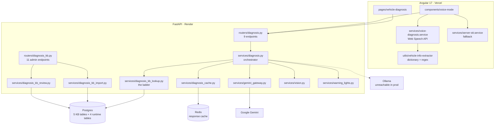
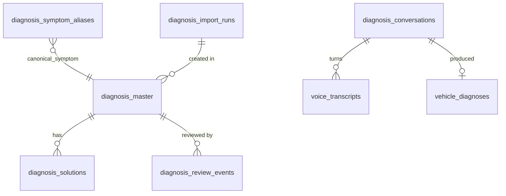
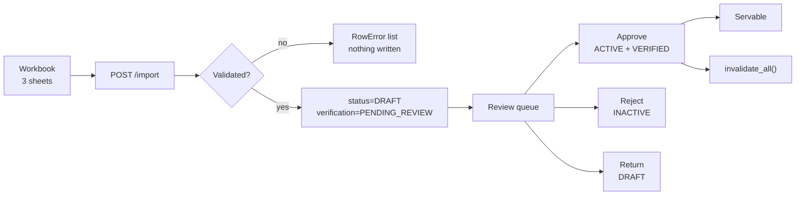

# AI Diagnosis Module — Design

**Version:** 1.0
**Date:** 2026-08-15
**Scope:** the vehicle fault-diagnosis feature end to end — the knowledge base
behind it, the answer pipeline, the voice front end, the admin review loop, and
the rules that govern what a driver is allowed to be told.

**Method:** every statement here was read off the code at `9557ce4`. Counts and
constants are quoted with the file they came from so they can be re-checked
rather than trusted. Where something is designed but not switched on in
production, it says so — that distinction is the reason the previous document
set drifted.

**Related:** `HLD/SystemOverview.md` (what runs where) ·
`LLD/AIArchitecture.md` §0 (the ladder in the context of all AI use) ·
`docs/qa/AI_DIAGNOSIS_E2E_TEST_PLAN.md` · `docs/qa/VOICE_DIAGNOSIS_E2E_TEST_PLAN.md`

---

## 1. What the module is for, and the constraint that shapes it

A driver describes a fault in their own words — often by voice, often from the
roadside — and gets back a preliminary assessment: what is probably wrong, how
urgent it is, whether the car is safe to drive, what it will likely cost, and
what to do next.

One constraint drives nearly every design decision below:

> **A wrong answer here is not a bad search result. It is someone driving a car
> that should be on a flatbed.**

A language model produces fluent, confident, plausible text whether or not it
is right, and at the call site a fabricated brake diagnosis is indistinguishable
from a correct one. So the module is built **knowledge-base-first**: a curated,
human-verified row is the preferred answer, and the model is what happens when
nothing curated matches — not what happens on every request.

Three rules follow from that, and they are enforced in code rather than in
review:

| Rule | Where enforced |
|---|---|
| A row reaches a driver only if a **human approved it** | `models/diagnosis_kb.py::is_servable` — needs `status = ACTIVE` **and** `verification_status = VERIFIED` |
| A model **cannot promote its own output** | `services/diagnosis_kb_import.py` forces `AI_GENERATED` rows to `PENDING_REVIEW`; `diagnosis_kb_review.py::_refuse_unreviewable` blocks silent approval |
| A **safety-critical** answer is never cached and never shortcut | `services/diagnosis_cache.py::is_cacheable` |

---

## 2. Component map



---

## 3. The answer pipeline

`services/diagnosis.py::run_diagnosis` is the single entry point. Cheapest and
most trustworthy first:

```
 cache → DTC → alias → exact → semantic → Gemini → Ollama → heuristic
 └──────────────────┬──────────────────┘   └────────┬────────┘   └───┬──┘
        curated, human-verified                 generative        last resort
```

### 3.1 Rung by rung

| # | Rung | Serves when | Cost | `engine` |
|---|---|---|---|---|
| 0 | **Response cache** | Same question, same vehicle, same language, within 6h | ~1ms | `<engine>:cached` |
| 1 | **DTC** | An error code was supplied — it identifies the fault directly, so it outranks anything inferred from prose | 1 indexed query | `knowledge_base` |
| 2 | **Alias** | A phrase the driver used maps to a canonical symptom | 1 indexed query | `knowledge_base` |
| 3 | **Exact** | Canonical symptom + vehicle scope match a row | 1 indexed query | `knowledge_base` |
| 4 | **Semantic** | Cosine similarity ≥ **0.62** over BGE embeddings | in-process vectors | `knowledge_base` |
| 5 | **Gemini** | Premium tier, nothing curated matched | 1 API call | `gemini` |
| 6 | **Ollama** | Free tier, or Gemini failed | 1 HTTP call | `ollama` |
| 7 | **Heuristic** | Everything above failed | local | `heuristic` |

Constants: `MIN_SEMANTIC_SIMILARITY = 0.62`, `_SEMANTIC_CANDIDATES = 10`
(`diagnosis_kb_lookup.py:68,367`); `TTL_SECONDS = 6 * 60 * 60`
(`diagnosis_cache.py:50`); embeddings are `BAAI/bge-small-en-v1.5`, 384-dim, CPU
(`services/embeddings.py:10`).

### 3.2 Two subtleties worth knowing

**The semantic rung must respect vehicle scope.** It is the one rung where a
scored similarity can outrank an exact field match, and an early version scored
across the whole corpus — it served Tata rows to a Maruti driver. Exact and
semantic now share `_vehicle_scope_clauses()` so they cannot diverge again. CI
caught this; a local sandbox could not, because `fastembed` could not download
its model there and the rung silently no-opped.

**A KB fault must never fail the request.** `lookup()` wraps everything in a
broad `except` and returns `None`, which falls through to the model. An empty or
half-imported corpus is the *normal* early state; it must degrade to the
previous behaviour rather than take the endpoint down.

### 3.3 The cache, and what it refuses

Key: `"dx:" + sha256(normalised_question | manufacturer | model | year | fuel |
language)[:40]` (`diagnosis_cache.py::build_key`). Hashed because a symptom
description is unbounded user text.

Backend is Redis, with an in-process dict fallback capped at 500 entries so one
worker cannot grow unbounded. **`REDIS_URL` is unset in production**, so today
the cache is per-process and does not survive a restart or span workers.

`is_cacheable()` refuses to store an answer that:

- came from a **photo** (`has_images`) — the answer is about that image
- came from the **heuristic** engine — it is a floor, not a finding
- is **safety-critical**, `risk_level == "Critical"`, or
  `immediate_service_required`

The last one is the important one. A cached "stop driving" answer served to the
next driver whose description merely *hashed the same* would be wrong in the
most expensive direction. Fresh evaluation is cheap next to that.

A KB import calls `invalidate_all()` (scans `dx:*`), because an import can
change what a verified row says and a stale copy would outlive the correction by
up to the TTL.

---

## 4. Data model

Five knowledge-base tables (migrations `0032`, `0033`) and four runtime tables.



### 4.1 `diagnosis_master` — the finding

Grouped by purpose:

- **Identity** — `diagnosis_code` (unique)
- **Vehicle scope** — `manufacturer`, `model`, `variant`, `engine_code`,
  `transmission`, `model_year_from/to`, `fuel_type`, `odometer_from/to_km`
- **Classification** — `system`, `subsystem`, `error_code`, `related_error_codes`
- **Symptom** — `canonical_symptom`, `symptom`, `user_keywords`
- **The finding** — `possible_cause`, `diagnostic_steps`, `confirms_when`,
  **`rule_out`**
- **Risk** — `severity`, `safety_critical`, `can_drive`, `recommended_action`,
  `requires_professional`
- **Cost** — `estimated_cost_min/max` (roll-up; per-solution costs live on the
  children)
- **Provenance** — `source_type`, `source_name`, `source_url`,
  `confidence_score`, `verification_status`, `last_verified`, `reviewed_by`,
  `reviewed_at`, `status`, `notes`

`rule_out` exists because a plausible row served for a symptom it does not
actually explain is the failure mode that curation is supposed to prevent. It
records what would mean *it is not this*.

Three indexes, each matching a real access path:

| Index | Columns | Serves |
|---|---|---|
| `ix_dm_lookup` | manufacturer, model, fuel_type, canonical_symptom, status | rungs 2–3 (make/model first: they eliminate most rows) |
| `ix_dm_dtc` | error_code, manufacturer, model | rung 1 |
| `ix_dm_servable` | status, verification_status | the serving gate — both, together |

### 4.2 `diagnosis_solutions` — the fixes

Many per diagnosis, ordered by `sequence`. Two flags that look redundant and are
not:

- `is_temporary_fix` — topping up coolant gets you home
- `resolves_root_cause` — it does not fix the leak

They are independent: a software update can be permanent *and* still not address
a failing sensor. Collapsing them into one flag would force one of those to be
described wrongly, and **a bypass presented as a repair is how somebody breaks
down twice**.

### 4.3 The rest

| Table | Holds |
|---|---|
| `diagnosis_symptom_aliases` | driver phrasing → canonical symptom (rung 2) |
| `diagnosis_review_events` | append-only decision log; `ck_dre_target_present` requires a target |
| `diagnosis_import_runs` | one row per workbook import, with row counts and errors |
| `vehicle_diagnoses` | the answers served to users (history) |
| `diagnosis_conversations`, `voice_transcripts`, `diagnosis_audit_events` | the voice session, its turns, and consent/erasure events |

### 4.4 Enums

`Severity`, `CanDrive`, `SolutionType`, `Difficulty`, `WarrantyImpact`,
`SourceType`, `RecordStatus`, `VerificationStatus`, `ReviewDecision` — all
native Postgres enums via `values_callable`, which persists the **value**, not
the Python name. CI runs on SQLite and will not catch a mistake here; the
Postgres job will.

---

## 5. API surface

### 5.1 Driver-facing — `routers/diagnosis.py`

| Method | Path | Auth | Notes |
|---|---|---|---|
| POST | `/diagnosis/analyse` | optional | The main call. 201 |
| GET | `/diagnosis/history` | required | Last 20, own only |
| GET | `/diagnosis/{id}` | required | **404** for someone else's, not 403 |
| DELETE | `/diagnosis/{id}` | required | 204 |
| POST | `/diagnosis/voice/consent` | optional | Recorded before capture |
| DELETE | `/diagnosis/voice/data` | required | Erasure |
| POST | `/diagnosis/voice/extract` | rate-limited | Transcript → fields |
| POST | `/diagnosis/stt` | rate-limited | **503** — no provider configured |
| POST | `/diagnosis/tts` | rate-limited | **503** — no provider configured |

`GET /{id}` returns **404** rather than 403 for a report the caller does not
own, and treats a NULL `user_id` as *nobody* rather than *anybody*. A 403
confirms the resource exists, which is itself a disclosure. This was a real
defect: ownerless reports were readable by any signed-in user.

### 5.2 Admin — `routers/diagnosis_kb.py` (all behind `adminGuard`)

`GET /stats` · `POST /import` · `GET /import-history` ·
`GET /review-queue[/summary|/{id}]` · `POST /review/{id}` ·
`POST /review/solution/{id}` · `GET /review-history` ·
`GET /cache/stats` · `POST /cache/invalidate`

### 5.3 Request and response contracts

`DiagnoseRequest` validates at the boundary: `model_year` 1990–2030,
`fuel_type` and `transmission` against fixed patterns, `problem_description`
10–2000 chars, `image_urls` max 5, `maintenance_history` max 20.

`DiagnoseResponse` always carries `engine`, `model_tier`, `analysis_confidence`,
`disclaimer`, and — the point of a response model — `possible_causes` as typed
`PossibleCause` objects. That contract earned itself: the KB path once emitted
`likelihood` where the model required `confidence`, and **every knowledge-base
answer 500'd**. Unit tests asserted on the service dict and passed; nothing
crossed the response model until an E2E test did.

---

## 6. Voice

### 6.1 There is no speech model in our stack

Transcription is the **browser's Web Speech API** — in Chrome, Google's cloud
recogniser. We never see the audio, cannot tune it, and cannot choose the model.

`POST /diagnosis/stt` exists as a fallback for WebViews without the API, but
`STT_PROVIDER` defaults to `"none"` and is unset in production, so it returns
503. **Nothing uses it today.** Wiring a provider (Whisper) is the only way to
get a speech model we control.

```
mic → Chrome/Google recogniser → text → our parser → fields → POST /analyse
```

### 6.2 The parser, and two bugs it has already caused

`utils/vehicle-info-extractor.ts` is a dictionary + regex pass over the
transcript, with `POST /diagnosis/voice/extract` as the LLM fallback for
free-form phrasing and native-script names.

Both production voice bugs lived here:

1. **Sentences truncated at the first pause.** `continuous = true` makes a real
   engine emit one *final* result per phrase, so "my Maruti Swift 2019 petrol
   manual" arrived in three pieces and the first one was delivered immediately —
   three user turns from one sentence. Fixed by buffering finals and delivering
   once after **1100 ms** of silence.
2. **The year was asked for repeatedly.** A recogniser returns words —
   `"twenty nineteen"`, never `"2019"` — and the parser matched a four-digit
   numeral only. Fixed; it now reads century-word forms, `two thousand (and) N`,
   split digits, and anchored two-digit years, while still refusing to turn
   `i20` into 2020.

The second bug had a second cause worth recording: the backend fallback went
**only to Ollama**, whose host is unset in production, so it returned `{}` on
every call and the regex was the entire extractor. It now tries Gemini first
through the gateway.

### 6.3 Consent and erasure

Consent is recorded before any capture, separately from the OS microphone
permission — they are different gates and a user can grant one and refuse the
other. `DELETE /diagnosis/voice/data` erases transcripts. Events land in
`diagnosis_audit_events`.

---

## 7. The curation loop



The importer reads three sheets — `diagnosis_master`, `diagnosis_solutions`,
`symptom_aliases` — validates every row before writing any, and reports
`(sheet, row, column, reason)` for each failure. An `AI_GENERATED` row is forced
to `PENDING_REVIEW` regardless of what the workbook claims.

`_refuse_unreviewable()` blocks two approvals that are easy to click and
expensive to get wrong: a row missing `symptom`, `possible_cause` or
`recommended_action`, and silent approval of `AI_GENERATED` content. The cost of
the extra step falls on the reviewer rather than on a driver.

Review decisions are **append-only** in `diagnosis_review_events`. Who approved
what, and when, is the audit trail behind every answer served.

---

## 8. Safety and abuse

| Control | Implementation |
|---|---|
| **Prompt injection** | `_INJECTION_PATTERN` redacts instruction overrides and role reassignment; `_sanitise()` applied to every user field with per-field length caps |
| **Disclaimer** | `_DISCLAIMER` attached to every response — KB and model paths alike |
| **No invented certainty** | `analysis_confidence` returned; below `LOW_CONFIDENCE_THRESHOLD = 70` the response sets `needs_more_info` and returns up to 3 `follow_up_questions` instead of guessing |
| **Translation honesty** | `translation_failed: true` when a non-English response was requested but the text is still English — the client says so rather than silently misleading |
| **Rate limits** | On `/analyse`, `/stt`, `/tts`, `/voice/extract` |
| **Ownership** | 404-not-403; NULL owner is nobody |
| **Observability** | One structured `diagnosis_latency` record per request: engine, tier, fallback reason, retrieval method, elapsed ms |

The same principle as `services/credit_bureau.py::fetch_score`, which raises
rather than returning a plausible number, applies throughout: **a fabricated
value is indistinguishable from a real one at the call site**, so the module
would rather return less than invent more.

---

## 9. Test coverage

| Suite | Cases | Covers |
|---|---|---|
| `tests/test_diagnosis.py` | 80 | Orchestrator, prompt fencing, translation, voice extraction, endpoints |
| `tests/test_diagnosis_e2e.py` | 48 | Seeded corpus through the real HTTP surface |
| `tests/test_diagnosis_kb_lookup.py` | 39 | Every rung, including vehicle-scope isolation |
| `tests/test_diagnosis_kb_import.py` | 21 | Validation, row errors, AI_GENERATED forcing |
| `e2e/voice-diagnosis.spec.ts` | 20 | Real Chromium, fake media device |

**188 API cases and 20 browser cases.** Two defects were found by these suites
and by nothing else: the response-model mismatch that 500'd every KB answer, and
the ownership hole on `GET /{id}`.

Two cautions that apply to reading any green run here:

- **CI runs on SQLite; production is Postgres.** Green CI says nothing about
  native enums, `NOT NULL` behaviour, or casting.
- **Test classes must be named `Test*Suite` or `Test*Case`** (`pyproject.toml`).
  Anything else collects **zero tests** and passes silently.
- **Every Playwright project declares a `testMatch`.** A spec matching no
  pattern runs nowhere and reports nothing — which looks exactly like passing.

---

## 10. Production state — designed vs switched on

Being explicit, because this is where the previous document set went wrong.

| Capability | Built | On in production | Consequence if off |
|---|---|---|---|
| KB ladder (DTC/alias/exact) | ✅ | ✅ | — |
| Semantic rung | ✅ | ✅ | — |
| Gemini (premium) | ✅ | ✅ `GEMINI_API_KEY` set | — |
| Response cache | ✅ | ⚠️ **no `REDIS_URL`** | Per-process, lost on restart, not shared across workers |
| Ollama (free tier) | ✅ | ❌ **`OLLAMA_BASE_URL` unset** | Free-tier diagnosis falls to the heuristic |
| Vision on photos | ✅ | ❌ same reason | `vision_analysis` absent; `warning_light_match` still works |
| Server-side STT/TTS | ✅ | ❌ `STT_PROVIDER = "none"` | Endpoints 503; browser API is the only engine |
| Review queue | ✅ | ✅ | — |

Every one of these degrades quietly by design. That is correct for resilience
and it is exactly why documentation drifts: **nothing breaks visibly when a
subsystem is switched off.**

---

## 11. Known gaps

1. **`REDIS_URL` unset** — the cache does not do its job in production. One
   config value.
2. **The whole free tier has no model.** With Ollama unreachable, a non-premium
   user who misses the KB gets the heuristic. Either point `OLLAMA_BASE_URL`
   somewhere real or route the free tier through Gemini with a cheaper budget.
3. **No speech model we control** (§6.1).
4. **Corpus coverage is the real ceiling.** Every rung above the model is only
   as good as the number of verified rows. Coverage per make/model is not
   currently reported — `GET /kb/stats` counts rows, not gaps, so nobody can see
   which vehicles fall through to the model.
5. **`0.62` is a judgement, not a measurement.** The semantic floor was chosen
   to be conservative and has never been tuned against a labelled set.
