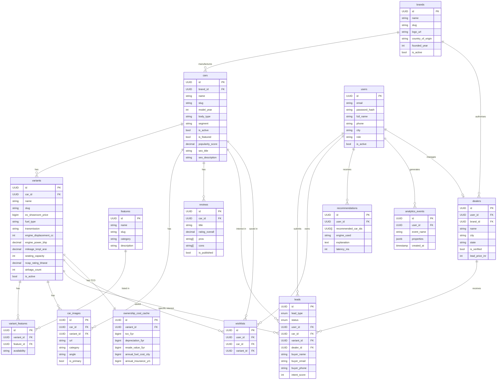

# GAADIIQ.COM — Entity Relationship Diagram

**Version:** 1.0  
**Date:** 2026-06-24

---

## 1. Full ER Diagram (Mermaid ERD)

---

## 2. Relationship Summary

| Relationship | Cardinality | Notes |
|---|---|---|
| Brand → Cars | 1:N | One brand has many car models |
| Car → Variants | 1:N | One model has 2–15 variants |
| Car → Images | 1:N | Multiple images per model/variant |
| Car → Reviews | 1:N | One expert review per model (typically) |
| Variant → Features | M:N | Via `variant_features` join table |
| Variant → OwnershipCost | 1:1 | Pre-computed TCO per variant |
| User → Leads | 1:N | User can submit multiple leads |
| User → Wishlists | 1:N | User can shortlist many cars |
| User → Dealer | 1:1 | Optional — dealer users have a dealers record |
| Dealer → Leads | 1:N | Dealer receives many leads |
| Brand → Dealers | 1:N | Brand has many authorised dealers |

---

## 3. Index Strategy Summary

| Table | Index | Type | Purpose |
|---|---|---|---|
| `brands` | `slug` | BTREE UNIQUE | URL routing |
| `cars` | `brand_id` | BTREE | Brand filter |
| `cars` | `slug` | BTREE UNIQUE | URL routing |
| `cars` | `body_type` | BTREE | Body type filter |
| `variants` | `car_id` | BTREE | Car → variants |
| `variants` | `fuel_type` | BTREE | Fuel filter |
| `variants` | `ex_showroom_price` | BTREE | Price sort/filter |
| `leads` | `dealer_id` | BTREE | Dealer dashboard |
| `leads` | `created_at DESC` | BTREE | Recent leads |
| `analytics_events` | `created_at DESC` | BTREE (partitioned) | Time-series queries |
| `dealers` | `(latitude, longitude)` | BTREE | Geo proximity queries |

---

## 4. Data Volume Estimates (Year 1)

| Table | Expected Rows | Storage Est. |
|---|---|---|
| `brands` | 25 | < 1 MB |
| `cars` | 150 | < 5 MB |
| `variants` | 500 | < 20 MB |
| `features` | 200 | < 1 MB |
| `variant_features` | 25,000 | < 10 MB |
| `car_images` | 3,000 | < 5 MB (URLs only) |
| `reviews` | 150 | < 10 MB |
| `users` | 100,000 | < 50 MB |
| `dealers` | 500 | < 1 MB |
| `leads` | 50,000 | < 20 MB |
| `wishlists` | 200,000 | < 30 MB |
| `recommendations` | 500,000 | < 100 MB |
| `analytics_events` | 5,000,000 | < 250 MB |
| **Total** | | **~500 MB** |

This fits within **Supabase Free Tier (500MB)** for Year 1. Analytics events partitioned and older partitions archived to Cloudflare R2 if needed.

---

*Part of Phase 2 LLD. See: [DatabaseDesign.md](DatabaseDesign.md) | [APIContracts.md](APIContracts.md)*
