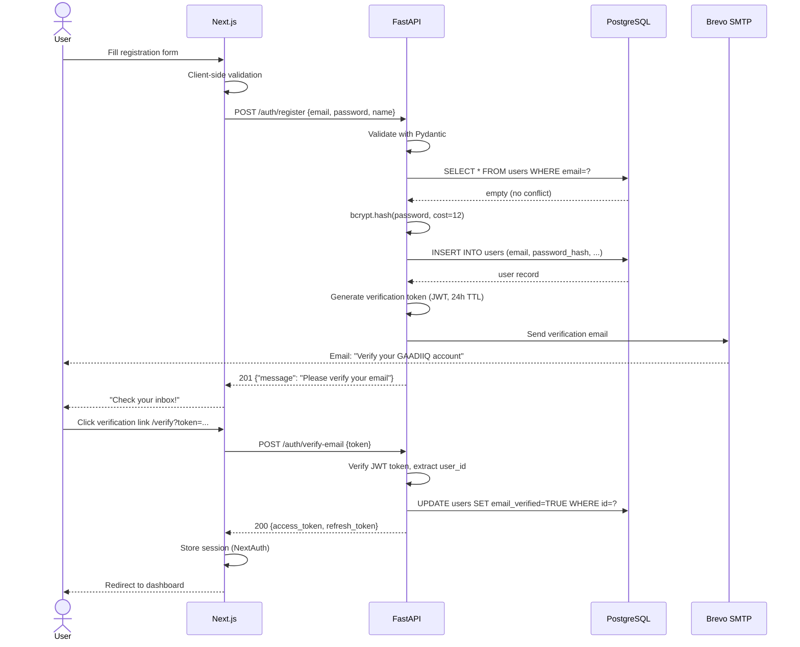
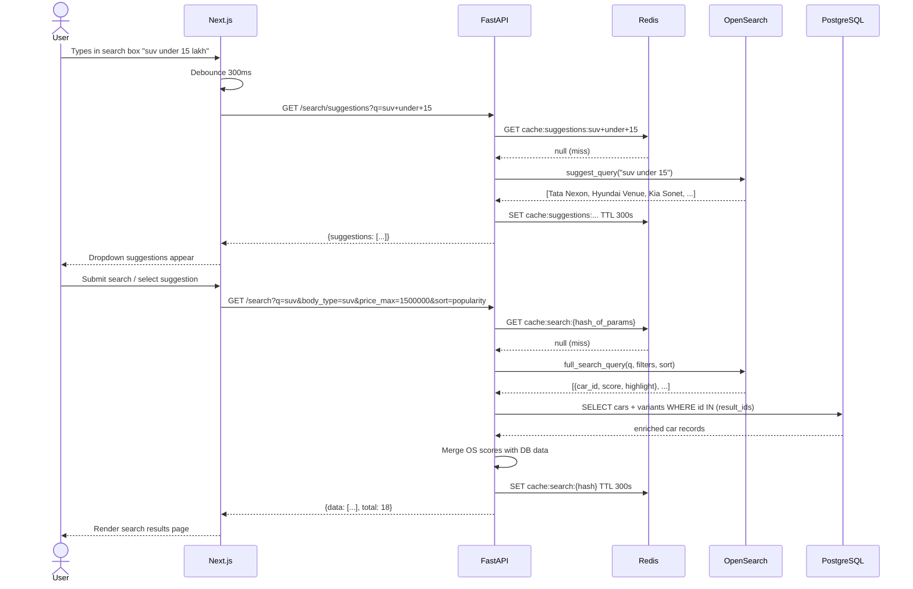
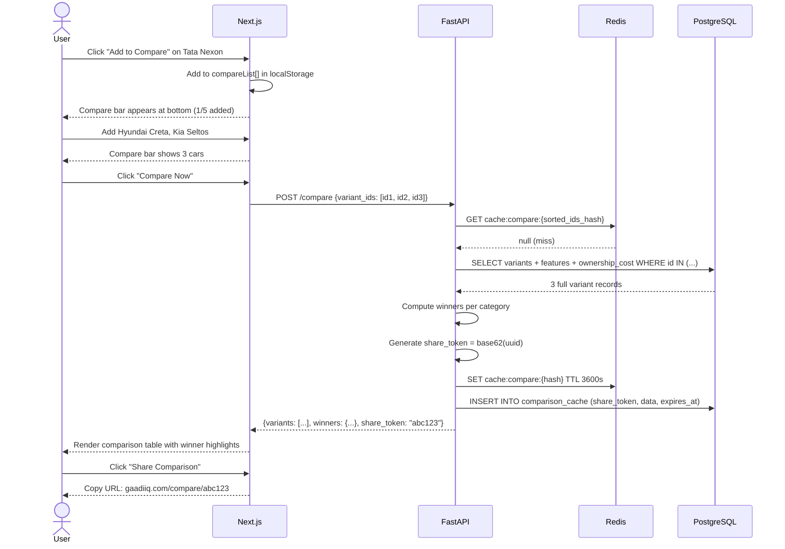
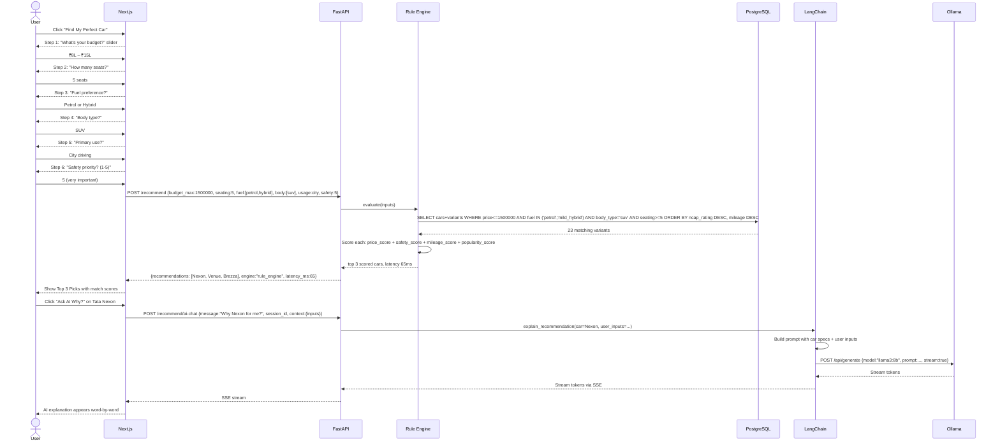
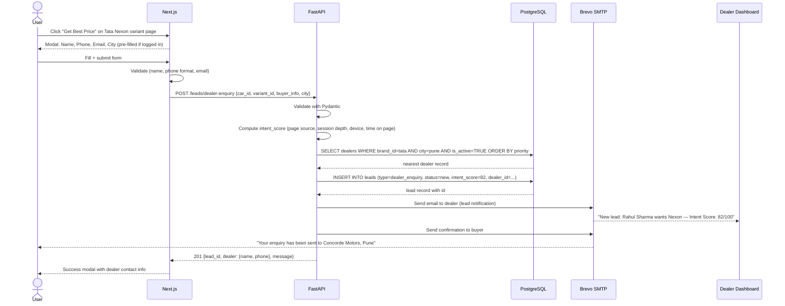
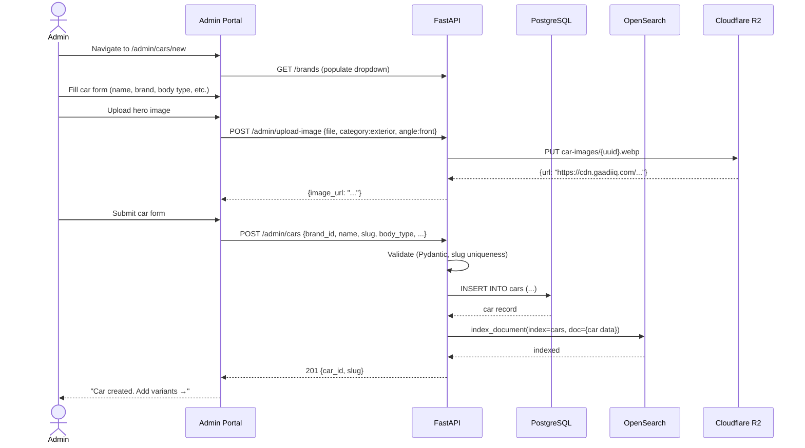
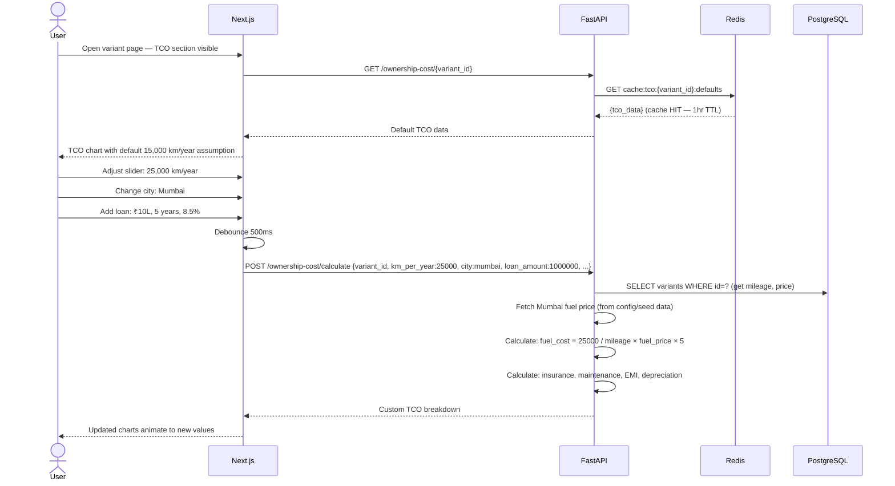

# GAADIIQ.COM — Sequence Diagrams

**Version:** 1.0  
**Date:** 2026-06-24

---

## 1. User Registration & Email Verification

---

## 2. Car Search Flow

---

## 3. Car Comparison Flow

---

## 4. AI Recommendation Wizard

---

## 5. Dealer Lead Submission

---

## 6. Admin: Add New Car

---

## 7. TCO Calculator Interaction

---

*Part of Phase 2 LLD. See: [UIArchitecture.md](UIArchitecture.md) | [AIArchitecture.md](AIArchitecture.md)*
