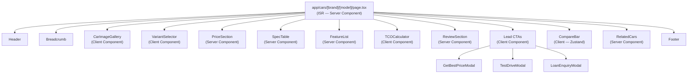

# GAADIIQ.COM — UI Architecture

**Version:** 1.0  
**Date:** 2026-06-24  
**Framework:** Next.js 14 App Router · TypeScript · Tailwind CSS · ShadCN UI

---

## 1. Rendering Strategy Per Page

| Route | Rendering | Revalidate | Reason |
|---|---|---|---|
| `/` (Home) | ISR | 1 hour | Dynamic featured cars, news |
| `/cars` (Listing) | ISR | 30 min | Prices/inventory change |
| `/cars/[brand]` | ISR | 1 hour | Brand pages stable |
| `/cars/[brand]/[model]` | ISR | 30 min | Price changes |
| `/cars/[brand]/[model]/[variant]` | ISR | 30 min | Full spec pages |
| `/compare` | CSR | N/A | User-driven, no SEO |
| `/search` | CSR | N/A | User query, no SEO |
| `/recommend` | CSR | N/A | AI wizard, interactive |
| `/ownership-cost` | CSR | N/A | Calculator, interactive |
| `/admin/*` | CSR | N/A | Auth-protected |
| `/profile` | CSR | N/A | User data |

---

## 2. Directory Structure

```
frontend/
├── app/
│   ├── layout.tsx                    # Root layout (fonts, theme, providers)
│   ├── page.tsx                      # Home page
│   ├── cars/
│   │   ├── page.tsx                  # Car listing
│   │   ├── [brand]/
│   │   │   ├── page.tsx              # Brand page
│   │   │   └── [model]/
│   │   │       ├── page.tsx          # Car detail
│   │   │       └── [variant]/
│   │   │           └── page.tsx      # Variant detail
│   ├── compare/
│   │   └── page.tsx
│   ├── search/
│   │   └── page.tsx
│   ├── recommend/
│   │   └── page.tsx
│   ├── ownership-cost/
│   │   └── page.tsx
│   ├── admin/
│   │   ├── layout.tsx               # Admin layout (auth guard)
│   │   ├── page.tsx                 # Dashboard
│   │   ├── cars/
│   │   │   ├── page.tsx             # Car list
│   │   │   └── [id]/page.tsx        # Edit car
│   │   ├── leads/
│   │   │   └── page.tsx
│   │   └── users/
│   │       └── page.tsx
│   ├── auth/
│   │   ├── login/page.tsx
│   │   └── register/page.tsx
│   └── profile/
│       └── page.tsx
│
├── components/
│   ├── ui/                          # ShadCN base components (auto-generated)
│   │   ├── button.tsx
│   │   ├── card.tsx
│   │   ├── dialog.tsx
│   │   ├── input.tsx
│   │   ├── slider.tsx
│   │   ├── badge.tsx
│   │   └── ...
│   ├── layout/
│   │   ├── Header.tsx
│   │   ├── Footer.tsx
│   │   ├── MobileNav.tsx
│   │   └── Breadcrumb.tsx
│   ├── cars/
│   │   ├── CarCard.tsx              # Car grid card
│   │   ├── CarGrid.tsx              # Responsive grid
│   │   ├── CarFilters.tsx           # Filter sidebar
│   │   ├── CarImageGallery.tsx      # Image carousel
│   │   ├── SpecTable.tsx            # Spec grid
│   │   ├── FeatureList.tsx          # Feature checklist by category
│   │   ├── CompareBar.tsx           # Sticky bottom compare bar
│   │   └── VariantSelector.tsx      # Variant tabs
│   ├── comparison/
│   │   ├── CompareTable.tsx         # Side-by-side table
│   │   ├── WinnerBadge.tsx          # "Best" badge
│   │   └── ShareComparison.tsx      # Share button + modal
│   ├── ownership-cost/
│   │   ├── TCOCalculator.tsx        # Main calculator
│   │   ├── TCOChart.tsx             # Recharts bar/pie
│   │   ├── LoanEMIInput.tsx         # Loan inputs
│   │   └── FuelCostInput.tsx        # Fuel/km inputs
│   ├── recommendation/
│   │   ├── WizardStep.tsx           # Individual step wrapper
│   │   ├── BudgetStep.tsx
│   │   ├── PreferencesStep.tsx
│   │   ├── RecommendationCard.tsx   # Result card with match score
│   │   └── AIChatPanel.tsx          # Streaming chat
│   ├── leads/
│   │   ├── GetBestPriceModal.tsx    # Dealer lead form
│   │   ├── TestDriveModal.tsx       # Test drive booking
│   │   └── LoanEnquiryModal.tsx
│   ├── search/
│   │   ├── SearchBar.tsx            # Global search with suggestions
│   │   └── SearchResults.tsx
│   └── shared/
│       ├── PriceDisplay.tsx         # Format paise → ₹X.XX L
│       ├── RatingStars.tsx
│       ├── NCAPBadge.tsx
│       ├── FuelTypeBadge.tsx
│       ├── ImageWithFallback.tsx    # Next/Image with error fallback
│       ├── LoadingSpinner.tsx
│       └── SeoHead.tsx
│
├── hooks/
│   ├── useCompare.ts               # Compare list state (Zustand)
│   ├── useWishlist.ts              # Wishlist state
│   ├── useSearch.ts                # Search with debounce
│   ├── useTCOCalculator.ts         # Calculator state + API call
│   └── useAIAdvisor.ts             # SSE stream handler
│
├── lib/
│   ├── api.ts                      # Axios/fetch API client
│   ├── auth.ts                     # NextAuth config
│   ├── formatters.ts               # Price, mileage formatters
│   ├── analytics.ts                # GA4 event tracking
│   └── constants.ts                # Fuel prices, city list
│
├── store/
│   └── compareStore.ts             # Zustand global state
│
├── types/
│   ├── car.ts                      # Car, Variant, Brand interfaces
│   ├── lead.ts
│   ├── user.ts
│   └── api.ts                      # API response types
│
└── public/
    ├── icons/
    └── images/
```

---

## 3. Component Architecture: Car Detail Page



---

## 4. State Management

| State | Tool | Scope |
|---|---|---|
| Compare list (up to 5 cars) | Zustand + localStorage | Global |
| Wishlist | Zustand + API sync | Global (auth users) |
| TCO calculator inputs | React useState | Component |
| AI wizard answers | React useState | Page |
| Search query + filters | URL params (useSearchParams) | Page |
| User session | NextAuth | Global |
| Server data | React Query (TanStack Query) | Per-query |

---

## 5. Design System

### Theme Tokens (Tailwind + CSS Variables)

```css
:root {
  --color-primary: #E63B11;     /* GAADIIQ Orange — brand identity */
  --color-primary-dark: #C42E0A;
  --color-secondary: #1A2744;   /* Deep Navy */
  --color-accent: #F59E0B;      /* Amber — highlights, badges */
  --color-success: #10B981;     /* Emerald — match scores, winners */
  --color-surface: #FFFFFF;
  --color-surface-alt: #F8FAFC;
  --color-text: #0F172A;
  --color-text-muted: #64748B;
  --color-border: #E2E8F0;
  --radius: 0.5rem;
}

[data-theme="dark"] {
  --color-surface: #0F172A;
  --color-surface-alt: #1E293B;
  --color-text: #F1F5F9;
  --color-text-muted: #94A3B8;
  --color-border: #334155;
}
```

### Typography Scale

| Token | Size | Usage |
|---|---|---|
| `text-xs` | 12px | Labels, badges |
| `text-sm` | 14px | Body secondary |
| `text-base` | 16px | Body primary |
| `text-lg` | 18px | Card titles |
| `text-xl` | 20px | Section headings |
| `text-2xl` | 24px | Page headings |
| `text-3xl` | 30px | Hero headings |
| `text-4xl` | 36px | Brand statement |

Font: **Inter** (system fallback) — loaded via Next.js `next/font`.

---

## 6. Performance Budget

| Metric | Target | How Achieved |
|---|---|---|
| LCP (mobile 4G) | < 2.5s | ISR + Cloudflare CDN + Next/Image |
| FID / INP | < 100ms | No blocking JS; SSC server components |
| CLS | < 0.1 | Image dimensions set; skeleton loaders |
| JS bundle (initial) | < 150KB | Code splitting; dynamic imports for heavy components |
| Lighthouse score | > 85 | Image optimisation, font preload, no layout shift |
| TTFB | < 200ms | Vercel edge + CDN |

### Optimisation Techniques
- `next/image` for all car images (WebP, lazy loading, blur placeholder)
- Dynamic imports for: `CompareTable`, `TCOCalculator`, `AIChatPanel`
- `React.Suspense` + skeleton UI on all data-fetching components
- Route prefetching on hover for car links
- Service Worker for offline static assets (Phase 2)

---

## 7. Responsive Breakpoints

| Breakpoint | Width | Layout |
|---|---|---|
| `sm` | 640px | Mobile landscape |
| `md` | 768px | Tablet |
| `lg` | 1024px | Desktop |
| `xl` | 1280px | Wide desktop |
| `2xl` | 1536px | Ultra-wide |

- Car grid: 1 col (mobile) → 2 col (md) → 3 col (lg) → 4 col (xl)
- Compare table: horizontal scroll on mobile; full table on desktop
- Filters: bottom sheet (mobile) → sidebar (desktop)

---

## 8. SEO Implementation

Every car page has:
```tsx
export async function generateMetadata({ params }): Promise<Metadata> {
  const car = await getCar(params.slug)
  return {
    title: car.seo_title || `${car.name} Price, Specs, Review 2026 | GAADIIQ`,
    description: car.seo_description,
    openGraph: {
      title: car.name,
      description: car.seo_description,
      images: [car.primary_image],
      type: 'website'
    },
    alternates: { canonical: `https://gaadiiq.com/cars/${car.brand.slug}/${car.slug}` }
  }
}
```

Schema markup (JSON-LD) on car pages:
- `Product` schema (car as product with price)
- `Review` schema (expert review)
- `BreadcrumbList` schema
- `FAQPage` schema (AI-generated Q&A)

---

*Part of Phase 2 LLD. See: [AIArchitecture.md](AIArchitecture.md)*
