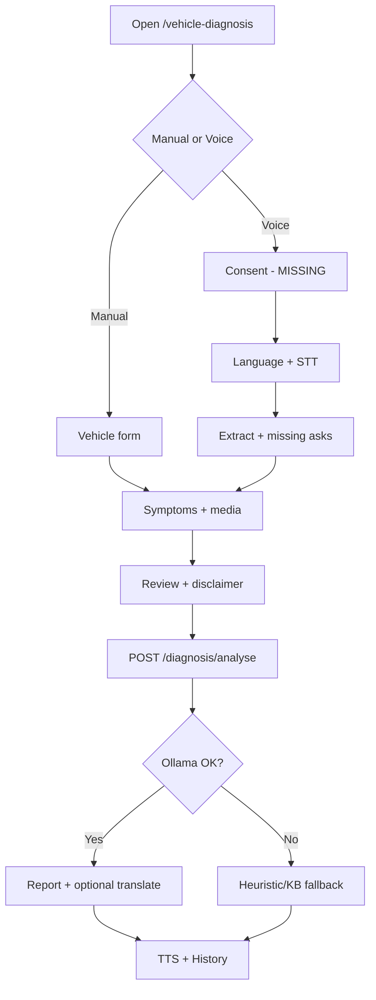

# GAADIIQ — AI Diagnosis Module
## Business Requirements Document (BRD) + E2E QA Results

| Field | Value |
|-------|-------|
| Product | GAADIIQ AI Vehicle Preliminary Diagnosis |
| Version | 1.1 (implementation-ready) |
| Date | 2026-07-25 13:56 UTC |
| Code tip audited | `claude/gaadiiq-app-dev-abj5fo` (voice multilingual: `733d258`…`14df98f`) |
| Docs branch | `cursor/ai-diagnosis-brd-qa-85e1` (docs-only; merge Claude tip before implementing voice ACs) |
| Status | **Partial vs full BRD — NOT production-ready for complete voice+media scope** |
| Audience | BA · Product · Engineering · UI/UX · QA |

---

## 1. Business Overview

### 1.1 Business problem
Indian vehicle owners delay repairs due to language barriers, opaque workshop advice, and fear of overcharging. They need fast, trustworthy, **multilingual** preliminary diagnosis before visiting a garage — including while hands are busy or literacy/English is limited.

### 1.2 Business objectives
1. Diagnose via **form or voice** in major Indian languages.
2. Return AI preliminary root cause, severity, safe-to-drive, cost/time, next steps, and preventive tips.
3. Support images (and audio/video per BRD) for richer context.
4. Be mobile-first, private (DPDP-aware), and production-reliable on Android/iOS WebView.
5. Reuse existing Ollama + repair KB engine with measurable quality and fallbacks.

### 1.3 Scope (in) — v1
- Manual 4-step diagnosis wizard
- Voice-first overlay (STT/TTS, language picker, extract, missing-field asks)
- Multilingual analyse responses (`detected_language`)
- Image upload + optional vision assist
- Diagnosis persistence + Past Diagnoses history (auth)
- Safety disclaimer + service-centre CTA
- Rate limits + IDOR protection on history detail

### 1.4 Out of scope (v1)
OBD-II / live sensors · certified medical-grade accuracy · full insurance claim filing · replacing licensed mechanic inspection · dealer DMS deep sync · always-on background listening without consent.

### 1.5 Assumptions
1. Users grant mic/camera when prompted (after consent UX ships).
2. Ollama may be unavailable; heuristic/KB fallback must still return a report.
3. Browser Web Speech is acceptable for **beta**; **GA requires server STT**.
4. Preliminary diagnosis always shows non-certified disclaimer.
5. Implementers work from Claude tip (or merge it) — master alone lacks voice stack.

### 1.6 Dependencies
| Dependency | Purpose |
|------------|---------|
| FastAPI `apps/api` diagnosis + upload routers | Analyse / history / media |
| Postgres `vehicle_diagnoses` | Persistence |
| Cloudflare R2 (or configured store) | Image (and future audio/video) |
| Ollama + `repair_knowledge.json` | LLM + keyword RAG |
| Capacitor Android/iOS | Mic/camera permissions |
| Web Speech / future Whisper|Google|Azure | STT |
| `speechSynthesis` / future server TTS | Playback |

---

## 2. User Personas

| Persona | Goals | Pain | Diagnosis needs |
|---------|-------|------|-----------------|
| Individual Car Owner | Understand issue before workshop | Overcharging fear | Clear cost + safe-to-drive |
| First-time Driver | Know if safe to continue | Panic / jargon | Simple language + TTS |
| Non-English Speaking User | Use Hindi/Tamil/etc. | English-only apps | Full journey in native language |
| Fleet Owner | Triage many vehicles | Downtime cost | History, severity, speed |
| Taxi Driver | Hands-busy, roadside | Can't type safely | Voice-first, driver-friendly |
| Dealer | Pre-inspect trade-ins | Inconsistent intake | Structured report + media |
| Service Advisor | Faster bay intake | Incomplete symptoms | Warning lights + photos + history |

---

## 3. Business Requirements — coverage vs code

**31 PASS / 19 PARTIAL / 14 FAIL** (64 requirements)  
**Weighted BRD readiness: 63/100**

| ID | Area | Priority | Requirement | Status | Gap |
|----|------|----------|-------------|--------|-----|
| BR-VI-01 | Vehicle Info | Must Have | Manual vehicle information entry | **PASS** | — |
| BR-VI-02 | Vehicle Info | Must Have | Voice-based vehicle information entry | **PASS** | — |
| BR-VI-03 | Vehicle Info | Must Have | Auto-extract vehicle details from speech | **PASS** | — |
| BR-VI-04 | Vehicle Info | Must Have | Auto-fill of vehicle information | **PASS** | — |
| BR-VI-05 | Vehicle Info | Must Have | Intelligent validation | **PASS** | — |
| BR-VI-06 | Vehicle Info | Must Have | Missing information prompts | **PASS** | — |
| BR-IR-01 | Issue Reporting | Must Have | Report issue using text | **PASS** | — |
| BR-IR-02 | Issue Reporting | Must Have | Report issue using voice | **PASS** | — |
| BR-IR-03 | Issue Reporting | Must Have | Upload vehicle images | **PASS** | — |
| BR-IR-04 | Issue Reporting | Must Have | Upload audio recordings | **FAIL** | No POST /upload/audio or Step 2 UI |
| BR-IR-05 | Issue Reporting | Must Have | Upload videos | **FAIL** | No video upload API/UI |
| BR-IR-06 | Issue Reporting | Must Have | Select dashboard warning lights | **PASS** | — |
| BR-IR-07 | Issue Reporting | Should Have | Add maintenance history | **FAIL** | Add maintenance_history JSON field |
| BR-ML-01 | Multilingual | Must Have | Automatic language detection | **PARTIAL** | Wire Auto-detect toggle into voice session |
| BR-ML-02 | Multilingual | Must Have | Support major Indian languages | **PASS** | PROMPTS fully localized for 6 only |
| BR-ML-03 | Multilingual | Must Have | Preserve user language in conversation | **PASS** | — |
| BR-ML-04 | Multilingual | Must Have | AI responses match user language | **PARTIAL** | Golden-set QA; English fallback banner |
| BR-VA-01 | Voice AI | Must Have | Speech-to-Text | **PARTIAL** | Server STT + MediaRecorder for WebView |
| BR-VA-02 | Voice AI | Must Have | Text-to-Speech | **PARTIAL** | Optional server TTS; keep client fallback |
| BR-VA-03 | Voice AI | Must Have | Live transcription | **PASS** | — |
| BR-VA-04 | Voice AI | Should Have | Voice playback | **PASS** | — |
| BR-VA-05 | Voice AI | Should Have | Replay | **PASS** | — |
| BR-VA-06 | Voice AI | Should Have | Pause | **PASS** | — |
| BR-VA-07 | Voice AI | Should Have | Stop | **PASS** | — |
| BR-VA-08 | Voice AI | Should Have | Hands-free mode | **PARTIAL** | Always-on driving mode |
| BR-VA-09 | Voice AI | Should Have | Driver-friendly interaction | **PARTIAL** | Driving mode + RECORD_AUDIO |
| BR-AI-01 | AI Diagnosis | Must Have | Ollama LLM integration | **PASS** | — |
| BR-AI-02 | AI Diagnosis | Must Have | RAG knowledge base | **PARTIAL** | Vector RAG over KB (Qdrant/BGE unused) |
| BR-AI-03 | AI Diagnosis | Must Have | Root cause prediction | **PASS** | — |
| BR-AI-04 | AI Diagnosis | Must Have | Severity prediction | **PASS** | — |
| BR-AI-05 | AI Diagnosis | Must Have | Safe-to-drive recommendation | **PASS** | — |
| BR-AI-06 | AI Diagnosis | Must Have | Estimated repair cost | **PASS** | — |
| BR-AI-07 | AI Diagnosis | Must Have | Estimated repair duration | **PASS** | — |
| BR-AI-08 | AI Diagnosis | Must Have | Recommended next steps | **PASS** | — |
| BR-AI-09 | AI Diagnosis | Should Have | Preventive maintenance suggestions | **PASS** | — |
| BR-AI-10 | AI Diagnosis | Should Have | Follow-up questions when required | **PARTIAL** | Post-diagnosis follow_up_questions[] |
| BR-UX-01 | UX | Must Have | Mobile-first design | **PARTIAL** | Dedicated mobile shell polish |
| BR-UX-02 | UX | Must Have | Progress indicators | **PASS** | — |
| BR-UX-03 | UX | Must Have | Conversation history | **PARTIAL** | No multi-turn conversation DB/UI; open-by-id weak |
| BR-UX-04 | UX | Must Have | Voice/Text switching | **PASS** | — |
| BR-UX-05 | UX | Must Have | Error handling | **PASS** | — |
| BR-UX-06 | UX | Should Have | Offline handling | **PARTIAL** | Offline banner; STT needs network |
| BR-SEC-01 | Security | Must Have | Microphone permissions | **PARTIAL** | Android RECORD_AUDIO + Capacitor helper |
| BR-SEC-02 | Security | Must Have | Voice data encryption | **PARTIAL** | At-rest encryption design for recordings |
| BR-SEC-03 | Security | Must Have | Secure storage | **PARTIAL** | Transcripts not stored securely |
| BR-SEC-04 | Security | Must Have | User consent for voice processing | **FAIL** | Pre-STT consent modal (purpose/retention) |
| BR-SEC-05 | Security | Must Have | Delete recordings | **FAIL** | Retention + DELETE voice APIs |
| BR-SEC-06 | Security | Must Have | Privacy compliance (DPDP) | **PARTIAL** | Diagnosis/voice delete UX |
| BR-PERF-01 | Performance | Must Have | Fast response time | **PARTIAL** | Ollama timeout ≤8s → fallback |
| BR-PERF-02 | Performance | Should Have | High STT accuracy | **PARTIAL** | WER benchmarks per language |
| BR-PERF-03 | Performance | Must Have | High AI response accuracy | **PARTIAL** | Golden-set fixtures in CI |
| BR-API-01 | API | Must Have | STT API | **FAIL** | POST /diagnosis/stt (multipart) |
| BR-API-02 | API | Must Have | TTS API | **FAIL** | POST /diagnosis/tts optional |
| BR-API-03 | API | Should Have | Language detection API | **FAIL** | POST /diagnosis/detect-language |
| BR-API-04 | API | Should Have | Translation API | **PARTIAL** | Not standalone endpoint |
| BR-API-05 | API | Must Have | AI Diagnosis API | **PASS** | — |
| BR-API-06 | API | Must Have | Image upload API | **PASS** | — |
| BR-API-07 | API | Must Have | Audio upload API | **FAIL** | POST /upload/audio |
| BR-DB-01 | Database | Must Have | Voice transcript storage | **FAIL** | voice_transcripts (consent-gated) |
| BR-DB-02 | Database | Must Have | Conversation history storage | **FAIL** | diagnosis_conversations |
| BR-DB-03 | Database | Must Have | AI diagnosis history | **PASS** | — |
| BR-DB-04 | Database | Should Have | Audit logs | **FAIL** | diagnosis_audit_events |
| BR-TEST-01 | Quality | Must Have | Automated diagnosis tests | **FAIL** | Add pytest + unit tests |
| BR-AND-01 | Mobile | Must Have | Android RECORD_AUDIO permission | **FAIL** | Add RECORD_AUDIO + runtime request |

### 3.1 Business justification (all IDs)

| ID | Priority | Justification |
|----|----------|---------------|
| BR-VI-01 | Must Have | Baseline path for users who prefer typing |
| BR-VI-02 | Must Have | Hands-free capture for drivers / literacy barriers |
| BR-VI-03 | Must Have | Reduce form friction after speech |
| BR-VI-04 | Must Have | Keep single source of truth for review step |
| BR-VI-05 | Must Have | Prevent invalid analyse payloads |
| BR-VI-06 | Must Have | Complete mandatory vehicle fields before analyse |
| BR-IR-01 | Must Have | Primary symptom capture |
| BR-IR-02 | Must Have | Speak symptoms in native language |
| BR-IR-03 | Must Have | Visual context for vision + mechanic handoff |
| BR-IR-04 | Must Have | Engine noise / rattles improve diagnosis |
| BR-IR-05 | Must Have | Capture intermittent symptoms |
| BR-IR-06 | Must Have | Structured symptom signals |
| BR-IR-07 | Should Have | Prior service context |
| BR-ML-01 | Must Have | Users may not know BCP-47 codes |
| BR-ML-02 | Must Have | India language coverage |
| BR-ML-03 | Must Have | Consistent journey language |
| BR-ML-04 | Must Have | Trust for non-English users |
| BR-VA-01 | Must Have | Production Android/iOS reliability |
| BR-VA-02 | Must Have | Playback on devices with weak voices |
| BR-VA-03 | Must Have | User confidence while speaking |
| BR-VA-04 | Should Have | Listen to diagnosis |
| BR-VA-05 | Should Have | Re-hear instructions |
| BR-VA-06 | Should Have | Interruptible playback |
| BR-VA-07 | Should Have | Immediate silence |
| BR-VA-08 | Should Have | Parked/driving safety |
| BR-VA-09 | Should Have | Large targets, reduced glances |
| BR-AI-01 | Must Have | Primary LLM path |
| BR-AI-02 | Must Have | Grounded repair advice |
| BR-AI-03 | Must Have | Core diagnosis value |
| BR-AI-04 | Must Have | Urgency signalling |
| BR-AI-05 | Must Have | Safety-critical output |
| BR-AI-06 | Must Have | Budget transparency |
| BR-AI-07 | Must Have | Time planning |
| BR-AI-08 | Must Have | Actionable guidance |
| BR-AI-09 | Should Have | Upsell prevention |
| BR-AI-10 | Should Have | Improve low-confidence cases |
| BR-UX-01 | Must Have | Primary usage is phone |
| BR-UX-02 | Must Have | Orient user in flow |
| BR-UX-03 | Must Have | Revisit prior advice |
| BR-UX-04 | Must Have | User preference |
| BR-UX-05 | Must Have | Recoverable failures |
| BR-UX-06 | Should Have | Low-connectivity India |
| BR-SEC-01 | Must Have | OS-level mic access |
| BR-SEC-02 | Must Have | Protect voice PII |
| BR-SEC-03 | Must Have | Controlled retention |
| BR-SEC-04 | Must Have | DPDP / lawful processing |
| BR-SEC-05 | Must Have | User control of biometric-adjacent data |
| BR-SEC-06 | Must Have | India DPDP Act readiness |
| BR-PERF-01 | Must Have | Perceived performance |
| BR-PERF-02 | Should Have | Voice trust |
| BR-PERF-03 | Must Have | Safety + usefulness |
| BR-API-01 | Must Have | WebView production path |
| BR-API-02 | Must Have | Consistent voice quality |
| BR-API-03 | Should Have | Server-side lang detect |
| BR-API-04 | Should Have | Reuse across modules |
| BR-API-05 | Must Have | Core backend |
| BR-API-06 | Must Have | Media pipeline |
| BR-API-07 | Must Have | Persist engine audio |
| BR-DB-01 | Must Have | Audit + improve STT |
| BR-DB-02 | Must Have | Multi-turn persistence |
| BR-DB-03 | Must Have | User revisit |
| BR-DB-04 | Should Have | Compliance + debug |
| BR-TEST-01 | Must Have | Prevent regressions |
| BR-AND-01 | Must Have | APK mic required |

---

## 4. Non-Functional Requirements (measurable)

| ID | Category | Target | Current | Status |
|----|----------|--------|---------|--------|
| NFR-P1 | Performance | Analyse p95 ≤ 5s; fallback ≤ 1s | Fallback OK; Ollama unbounded | PARTIAL |
| NFR-P2 | STT | WER ≤ 20% on clear hi-IN/en-IN lab set | No benchmark | FAIL |
| NFR-A1 | Availability | 99.5% report success via fallback | Heuristic fallback exists | PARTIAL |
| NFR-S1 | Scalability | 50 concurrent analyse with queue/timeout | Untested | FAIL |
| NFR-R1 | Reliability | Zero silent failures; always error or report | Error cards + fallback | PASS |
| NFR-SEC1 | Security | Consent before mic; authz on history | Authz OK; consent missing | PARTIAL |
| NFR-SEC2 | Privacy | DPDP delete within 72h of request | Delete UX missing | FAIL |
| NFR-A11Y | Accessibility | WCAG 2.1 AA on critical path | Partial labels | PARTIAL |
| NFR-M1 | Maintainability | Diagnosis pytest + extractor unit tests | Almost none | FAIL |
| NFR-O1 | Monitoring | Structured logs + latency metrics for analyse/STT | Partial API logs | PARTIAL |
| NFR-L1 | Logging | Audit consent, analyse, delete events | Missing audit table | FAIL |

---

## 5. UI/UX Requirements (screens)

| Screen | Required elements | Present on tip |
|--------|-------------------|----------------|
| Vehicle Details Form | Make/model/year/fuel/transmission; Manual/Voice mode | **Yes** |
| Voice Recording Interface | Lang picker, live transcript, mic states, cancel | **Yes** |
| AI Diagnosis / Review Screen | Confirm fields, disclaimer, submit | **Yes** |
| AI Result Screen | Causes, severity, safe-to-drive, cost, time, steps, DIY, preventive | **Yes** |
| Voice Playback Controls | Play / pause / stop / replay / mute | **Yes** |
| Conversation / Past History | List past diagnoses; open detail; conversation turns | **Partial** (list yes; turns/detail weak) |
| Media Upload | Images + audio + video | **Images only** |
| Maintenance History | Free text / structured prior service | **No** |
| Mic Consent Gate | Purpose, retention, accept/decline | **No** |
| Error Screens | Mic denied, STT fail, API fail, offline | **Partial** |

---

## 6. Process Flows

### 6.1 Manual diagnosis journey
1. Open `/vehicle-diagnosis` → choose Manual.  
2. Enter vehicle details → Next.  
3. Enter symptoms, warning lights, severity; optional photos → Next.  
4. Review + disclaimer → Analyse.  
5. View report (cost, safe-to-drive, steps) → optional TTS / service-centre CTA.  
6. If logged in, appears in Past Diagnoses.

### 6.2 Voice diagnosis journey
1. Choose Use Voice → **(gap)** consent modal → language picker.  
2. TTS greeting → speak vehicle → STT → extract (client + `/voice/extract`).  
3. Missing-field TTS asks until required fields complete.  
4. Speak problem → autofill form → optional lights/photos → review → analyse with `detected_language`.  
5. Server translates report fields when non-English → TTS reads report → pause/replay/stop.

### 6.3 AI processing workflow
Validate → optional vision on first `image_url` → keyword KB retrieve → Ollama (or heuristic) → translate → persist `vehicle_diagnoses` → return disclaimer-bound report.

### 6.4 Error handling workflow
| Failure | Expected UX |
|---------|-------------|
| Mic denied | Clear message + settings guidance (**APK RECORD_AUDIO gap**) |
| No-speech / low confidence | Retry with tip |
| Web Speech unsupported | **Should** fall back to MediaRecorder → `/diagnosis/stt` (**missing**) |
| API down | Client KB fallback report |
| Ollama timeout | Heuristic report (**timeout not enforced**) |
| Translation fail | English report + language fallback banner (**banner weak/unproven**) |

---

## 7. API Requirements

| API | Method | Status | Notes |
|-----|--------|--------|-------|
| `/diagnosis/analyse` | POST | **Exists** | Public + rate limit; fields include `audio_url`/`video_url`/`detected_language` |
| `/diagnosis/voice/extract` | POST | **Exists** (Claude tip) | `{ "transcript": str }` |
| `/diagnosis/history` | GET | **Exists** | Auth required |
| `/diagnosis/{id}` | GET | **Exists** | Auth + owner check (MOB-007) |
| `/upload/image` | POST | **Exists** | Auth; R2 |
| `/upload/audio` | POST | **Missing** | Magic bytes; max ~60s; returns URL |
| `/upload/video` | POST | **Missing** | Size/duration limits |
| `/diagnosis/stt` | POST | **Missing** | Multipart → transcript + lang |
| `/diagnosis/tts` | POST | **Missing** | Optional server TTS |
| `/diagnosis/detect-language` | POST | **Missing** | Text → BCP-47 |
| `/diagnosis/{id}` DELETE | DELETE | **Missing** | DPDP erasure |
| `/diagnosis/voice-data` DELETE | DELETE | **Missing** | Transcripts/recordings |

### 7.1 DiagnoseRequest (current tip)
`manufacturer, model, variant?, model_year, fuel_type, transmission, odometer_km?, problem_description, warning_lights[], when_occurs[], severity, image_urls[]?, audio_url?, video_url?, user_id?, detected_language?`

---

## 8. Database Impact

| Object | Action | Fields / notes |
|--------|--------|----------------|
| `vehicle_diagnoses` | Keep | Wire `audio_url`/`video_url`; add `maintenance_history` JSON; optional `confidence` |
| `diagnosis_conversations` | **Create** | `id, user_id, diagnosis_id?, language, turns JSONB, created_at` |
| `voice_transcripts` | **Create** | `id, user_id, consent_id, transcript, lang, audio_url?, created_at, expires_at` |
| `diagnosis_audit_events` | **Create** | `event_type, actor_id, entity_id, meta JSONB, created_at` |
| Consent store | **Create** | Mic/voice processing consent timestamp + version |

---

## 9. Business Rules

1. Problem text ≥ 10 characters **or** non-empty voice transcript before analyse.  
2. Images: jpeg/png/webp/heic; max 5; auth for upload.  
3. Audio (when built): ≤ 60s; mime allowlist; consent required before capture.  
4. Video (when built): max duration/size TBD; consent if mic track present.  
5. Always show safety disclaimer; never claim certified/OBD diagnosis.  
6. If `safe_to_drive=false`, show prominent stop-driving warning before secondary CTAs.  
7. Response language = user language; on failure show English + explicit banner.  
8. Guest may analyse; history and delete require authentication.  
9. Low confidence → `follow_up_questions` or low-confidence banner (follow-ups not yet returned).  
10. Prompt-injection: fence user free text; never execute instructions from `problem_description`.  
11. Voice data retention default ≤ 30 days unless user deletes earlier (policy TBD).  
12. Android builds must declare `RECORD_AUDIO` before shipping voice to Play.

---

## 10. Acceptance Criteria (all requirements)

### AC-BR-VI-01 — Manual vehicle entry — **PASS**
| Field | Detail |
|-------|--------|
| Requirement ID | BR-VI-01 |
| User Story | As a user, I want manual vehicle entry so the diagnosis journey meets BRD. |
| Preconditions | App on `/vehicle-diagnosis`; tip `claude/gaadiiq-app-dev-abj5fo` (or merged equivalent). |
| Given | User on Step 1 Manual mode |
| When | enters make/model/year/fuel |
| Then | fields validate and Next enables |
| Positive | Valid Maruti Swift 2019 |
| Negative | Empty make blocked |
| Edge | Unknown variant allowed as optional |
| Expected Result | Status **PASS** against current tip. |

### AC-BR-VI-02 — Voice vehicle entry — **PASS**
| Field | Detail |
|-------|--------|
| Requirement ID | BR-VI-02 |
| User Story | As a user, I want voice vehicle entry so the diagnosis journey meets BRD. |
| Preconditions | App on `/vehicle-diagnosis`; tip `claude/gaadiiq-app-dev-abj5fo` (or merged equivalent). |
| Given | Voice mode + language selected |
| When | user speaks vehicle details |
| Then | STT captures transcript and advances extract |
| Positive | Hindi Maruti speech |
| Negative | Mic denied shows error |
| Edge | No-speech retry |
| Expected Result | Status **PASS** against current tip. |

### AC-BR-VI-03 — Auto-extract from speech — **PASS**
| Field | Detail |
|-------|--------|
| Requirement ID | BR-VI-03 |
| User Story | As a user, I want auto-extract from speech so the diagnosis journey meets BRD. |
| Preconditions | App on `/vehicle-diagnosis`; tip `claude/gaadiiq-app-dev-abj5fo` (or merged equivalent). |
| Given | Transcript available |
| When | client/server extract runs |
| Then | manufacturer/model/year/fuel populated when present |
| Positive | en/hi/bn/ta brands |
| Negative | Gibberish → missing asks |
| Edge | Mixed Hindi-English |
| Expected Result | Status **PASS** against current tip. |

### AC-BR-VI-04 — Auto-fill form — **PASS**
| Field | Detail |
|-------|--------|
| Requirement ID | BR-VI-04 |
| User Story | As a user, I want auto-fill form so the diagnosis journey meets BRD. |
| Preconditions | App on `/vehicle-diagnosis`; tip `claude/gaadiiq-app-dev-abj5fo` (or merged equivalent). |
| Given | Extract result emitted |
| When | onVoiceCompleted runs |
| Then | form signals match extract |
| Positive | Partial extract fills only known |
| Negative | Overwrite confirmed fields carefully |
| Edge | User edits after fill |
| Expected Result | Status **PASS** against current tip. |

### AC-BR-VI-05 — Intelligent validation — **PASS**
| Field | Detail |
|-------|--------|
| Requirement ID | BR-VI-05 |
| User Story | As a user, I want intelligent validation so the diagnosis journey meets BRD. |
| Preconditions | App on `/vehicle-diagnosis`; tip `claude/gaadiiq-app-dev-abj5fo` (or merged equivalent). |
| Given | Form incomplete |
| When | user taps Next/Analyse |
| Then | validation errors shown; API rejects bad payloads |
| Positive | All required OK |
| Negative | Year out of range |
| Edge | Odometer optional |
| Expected Result | Status **PASS** against current tip. |

### AC-BR-VI-06 — Missing info prompts — **PASS**
| Field | Detail |
|-------|--------|
| Requirement ID | BR-VI-06 |
| User Story | As a user, I want missing info prompts so the diagnosis journey meets BRD. |
| Preconditions | App on `/vehicle-diagnosis`; tip `claude/gaadiiq-app-dev-abj5fo` (or merged equivalent). |
| Given | Extract missing year |
| When | voice asks for year |
| Then | user reply fills year |
| Positive | One missing field |
| Negative | Repeated no-speech |
| Edge | All fields missing |
| Expected Result | Status **PASS** against current tip. |

### AC-BR-IR-01 — Text issue report — **PASS**
| Field | Detail |
|-------|--------|
| Requirement ID | BR-IR-01 |
| User Story | As a user, I want text issue report so the diagnosis journey meets BRD. |
| Preconditions | App on `/vehicle-diagnosis`; tip `claude/gaadiiq-app-dev-abj5fo` (or merged equivalent). |
| Given | Step 2 |
| When | types ≥10 char problem |
| Then | accepted for analyse |
| Positive | Engine knock description |
| Negative | Too short blocked |
| Edge | Emoji-only |
| Expected Result | Status **PASS** against current tip. |

### AC-BR-IR-02 — Voice issue report — **PASS**
| Field | Detail |
|-------|--------|
| Requirement ID | BR-IR-02 |
| User Story | As a user, I want voice issue report so the diagnosis journey meets BRD. |
| Preconditions | App on `/vehicle-diagnosis`; tip `claude/gaadiiq-app-dev-abj5fo` (or merged equivalent). |
| Given | Step 2 mic or overlay |
| When | speaks problem |
| Then | transcript fills textarea |
| Positive | Tamil symptom speech |
| Negative | Mic denied |
| Edge | Noisy environment retry |
| Expected Result | Status **PASS** against current tip. |

### AC-BR-IR-03 — Image upload — **PASS**
| Field | Detail |
|-------|--------|
| Requirement ID | BR-IR-03 |
| User Story | As a user, I want image upload so the diagnosis journey meets BRD. |
| Preconditions | App on `/vehicle-diagnosis`; tip `claude/gaadiiq-app-dev-abj5fo` (or merged equivalent). |
| Given | Logged-in or upload path |
| When | selects photo |
| Then | image_urls on analyse |
| Positive | jpeg/png |
| Negative | Corrupt file reject |
| Edge | Max 5 images |
| Expected Result | Status **PASS** against current tip. |

### AC-BR-IR-04 — Audio upload — **FAIL**
| Field | Detail |
|-------|--------|
| Requirement ID | BR-IR-04 |
| User Story | As a user, I want audio upload so the diagnosis journey meets BRD. |
| Preconditions | App on `/vehicle-diagnosis`; tip `claude/gaadiiq-app-dev-abj5fo` (or merged equivalent). |
| Given | Step 2 |
| When | uploads/records audio |
| Then | audio_url persisted |
| Positive | N/A — not built |
| Negative | N/A |
| Edge | ≤60s when built |
| Expected Result | Status **FAIL** against current tip. |

### AC-BR-IR-05 — Video upload — **FAIL**
| Field | Detail |
|-------|--------|
| Requirement ID | BR-IR-05 |
| User Story | As a user, I want video upload so the diagnosis journey meets BRD. |
| Preconditions | App on `/vehicle-diagnosis`; tip `claude/gaadiiq-app-dev-abj5fo` (or merged equivalent). |
| Given | Step 2 |
| When | uploads video |
| Then | video_url persisted |
| Positive | N/A — not built |
| Negative | N/A |
| Edge | Size limit TBD |
| Expected Result | Status **FAIL** against current tip. |

### AC-BR-IR-06 — Warning lights — **PASS**
| Field | Detail |
|-------|--------|
| Requirement ID | BR-IR-06 |
| User Story | As a user, I want warning lights so the diagnosis journey meets BRD. |
| Preconditions | App on `/vehicle-diagnosis`; tip `claude/gaadiiq-app-dev-abj5fo` (or merged equivalent). |
| Given | Step 2 |
| When | toggles light chips |
| Then | array sent to API |
| Positive | Check engine |
| Negative | None selected OK |
| Edge | Multiple lights |
| Expected Result | Status **PASS** against current tip. |

### AC-BR-IR-07 — Maintenance history — **FAIL**
| Field | Detail |
|-------|--------|
| Requirement ID | BR-IR-07 |
| User Story | As a user, I want maintenance history so the diagnosis journey meets BRD. |
| Preconditions | App on `/vehicle-diagnosis`; tip `claude/gaadiiq-app-dev-abj5fo` (or merged equivalent). |
| Given | Step 2 |
| When | enters last service |
| Then | sent/stored |
| Positive | N/A — not built |
| Negative | N/A |
| Edge | Free text vs structured |
| Expected Result | Status **FAIL** against current tip. |

### AC-BR-ML-01 — Auto language detect — **PARTIAL**
| Field | Detail |
|-------|--------|
| Requirement ID | BR-ML-01 |
| User Story | As a user, I want auto language detect so the diagnosis journey meets BRD. |
| Preconditions | App on `/vehicle-diagnosis`; tip `claude/gaadiiq-app-dev-abj5fo` (or merged equivalent). |
| Given | Auto-detect on |
| When | user speaks Hindi |
| Then | session language becomes hi-IN |
| Positive | Currently PARTIAL/unwired |
| Negative | English mixed |
| Edge | Code-switch |
| Expected Result | Status **PARTIAL** against current tip. |

### AC-BR-ML-02 — Indian languages — **PASS**
| Field | Detail |
|-------|--------|
| Requirement ID | BR-ML-02 |
| User Story | As a user, I want indian languages so the diagnosis journey meets BRD. |
| Preconditions | App on `/vehicle-diagnosis`; tip `claude/gaadiiq-app-dev-abj5fo` (or merged equivalent). |
| Given | Language picker |
| When | selects kn/ml/gu/pa/or |
| Then | STT locale set |
| Positive | 11 langs listed |
| Negative | Unsupported locale |
| Edge | Device missing voice |
| Expected Result | Status **PASS** against current tip. |

### AC-BR-ML-03 — Preserve language — **PASS**
| Field | Detail |
|-------|--------|
| Requirement ID | BR-ML-03 |
| User Story | As a user, I want preserve language so the diagnosis journey meets BRD. |
| Preconditions | App on `/vehicle-diagnosis`; tip `claude/gaadiiq-app-dev-abj5fo` (or merged equivalent). |
| Given | hi-IN session |
| When | completes journey |
| Then | TTS/prompts stay Hindi |
| Positive | Full voice path |
| Negative | User switches mid-way |
| Edge | Reload restores lang |
| Expected Result | Status **PASS** against current tip. |

### AC-BR-ML-04 — AI language match — **PARTIAL**
| Field | Detail |
|-------|--------|
| Requirement ID | BR-ML-04 |
| User Story | As a user, I want ai language match so the diagnosis journey meets BRD. |
| Preconditions | App on `/vehicle-diagnosis`; tip `claude/gaadiiq-app-dev-abj5fo` (or merged equivalent). |
| Given | detected_language=ta-IN |
| When | analyse returns |
| Then | report Tamil or EN banner |
| Positive | Translation path exists |
| Negative | Ollama fails translate |
| Edge | Mixed scripts |
| Expected Result | Status **PARTIAL** against current tip. |

### AC-BR-VA-01 — STT — **PARTIAL**
| Field | Detail |
|-------|--------|
| Requirement ID | BR-VA-01 |
| User Story | As a user, I want stt so the diagnosis journey meets BRD. |
| Preconditions | App on `/vehicle-diagnosis`; tip `claude/gaadiiq-app-dev-abj5fo` (or merged equivalent). |
| Given | Mic allowed |
| When | speaks |
| Then | transcript appears |
| Positive | Chrome Web Speech |
| Negative | Android WebView often fails |
| Edge | Server STT missing |
| Expected Result | Status **PARTIAL** against current tip. |

### AC-BR-VA-02 — TTS — **PARTIAL**
| Field | Detail |
|-------|--------|
| Requirement ID | BR-VA-02 |
| User Story | As a user, I want tts so the diagnosis journey meets BRD. |
| Preconditions | App on `/vehicle-diagnosis`; tip `claude/gaadiiq-app-dev-abj5fo` (or merged equivalent). |
| Given | Report ready |
| When | auto-play |
| Then | speech heard; pause/stop work |
| Positive | Chrome voices |
| Negative | Silent device |
| Edge | No server TTS |
| Expected Result | Status **PARTIAL** against current tip. |

### AC-BR-VA-03 — Live transcription — **PASS**
| Field | Detail |
|-------|--------|
| Requirement ID | BR-VA-03 |
| User Story | As a user, I want live transcription so the diagnosis journey meets BRD. |
| Preconditions | App on `/vehicle-diagnosis`; tip `claude/gaadiiq-app-dev-abj5fo` (or merged equivalent). |
| Given | Listening |
| When | user speaks |
| Then | interimText updates |
| Positive | Continuous speech |
| Negative | Empty interim |
| Edge | Very long utterance |
| Expected Result | Status **PASS** against current tip. |

### AC-BR-VA-04 — Voice playback — **PASS**
| Field | Detail |
|-------|--------|
| Requirement ID | BR-VA-04 |
| User Story | As a user, I want voice playback so the diagnosis journey meets BRD. |
| Preconditions | App on `/vehicle-diagnosis`; tip `claude/gaadiiq-app-dev-abj5fo` (or merged equivalent). |
| Given | Report |
| When | TTS plays |
| Then | audio output |
| Positive | Auto-play on |
| Negative | Muted OS |
| Edge | Long report |
| Expected Result | Status **PASS** against current tip. |

### AC-BR-VA-05 — Replay — **PASS**
| Field | Detail |
|-------|--------|
| Requirement ID | BR-VA-05 |
| User Story | As a user, I want replay so the diagnosis journey meets BRD. |
| Preconditions | App on `/vehicle-diagnosis`; tip `claude/gaadiiq-app-dev-abj5fo` (or merged equivalent). |
| Given | TTS finished |
| When | Replay tapped |
| Then | replays report |
| Positive | Works |
| Negative | Nothing to replay |
| Edge | During pause |
| Expected Result | Status **PASS** against current tip. |

### AC-BR-VA-06 — Pause — **PASS**
| Field | Detail |
|-------|--------|
| Requirement ID | BR-VA-06 |
| User Story | As a user, I want pause so the diagnosis journey meets BRD. |
| Preconditions | App on `/vehicle-diagnosis`; tip `claude/gaadiiq-app-dev-abj5fo` (or merged equivalent). |
| Given | TTS playing |
| When | Pause |
| Then | speech pauses |
| Positive | Works |
| Negative | Already paused |
| Edge | OS interrupt |
| Expected Result | Status **PASS** against current tip. |

### AC-BR-VA-07 — Stop — **PASS**
| Field | Detail |
|-------|--------|
| Requirement ID | BR-VA-07 |
| User Story | As a user, I want stop so the diagnosis journey meets BRD. |
| Preconditions | App on `/vehicle-diagnosis`; tip `claude/gaadiiq-app-dev-abj5fo` (or merged equivalent). |
| Given | STT or TTS active |
| When | Stop |
| Then | recognition/speech stops |
| Positive | Works |
| Negative | Idle stop noop |
| Edge | Rapid toggle |
| Expected Result | Status **PASS** against current tip. |

### AC-BR-VA-08 — Hands-free — **PARTIAL**
| Field | Detail |
|-------|--------|
| Requirement ID | BR-VA-08 |
| User Story | As a user, I want hands-free so the diagnosis journey meets BRD. |
| Preconditions | App on `/vehicle-diagnosis`; tip `claude/gaadiiq-app-dev-abj5fo` (or merged equivalent). |
| Given | Voice session |
| When | after TTS prompt |
| Then | listening resumes |
| Positive | Partial auto-listen |
| Negative | No driving mode |
| Edge | Bluetooth headset |
| Expected Result | Status **PARTIAL** against current tip. |

### AC-BR-VA-09 — Driver-friendly — **PARTIAL**
| Field | Detail |
|-------|--------|
| Requirement ID | BR-VA-09 |
| User Story | As a user, I want driver-friendly so the diagnosis journey meets BRD. |
| Preconditions | App on `/vehicle-diagnosis`; tip `claude/gaadiiq-app-dev-abj5fo` (or merged equivalent). |
| Given | Phone in car |
| When | uses voice |
| Then | large targets / minimal typing |
| Positive | Overlay large |
| Negative | No driving mode |
| Edge | RECORD_AUDIO gap |
| Expected Result | Status **PARTIAL** against current tip. |

### AC-BR-AI-01 — Ollama — **PASS**
| Field | Detail |
|-------|--------|
| Requirement ID | BR-AI-01 |
| User Story | As a user, I want ollama so the diagnosis journey meets BRD. |
| Preconditions | App on `/vehicle-diagnosis`; tip `claude/gaadiiq-app-dev-abj5fo` (or merged equivalent). |
| Given | API up + Ollama |
| When | analyse |
| Then | LLM fields populated |
| Positive | Happy path |
| Negative | Ollama down → fallback |
| Edge | Timeout |
| Expected Result | Status **PASS** against current tip. |

### AC-BR-AI-02 — RAG KB — **PARTIAL**
| Field | Detail |
|-------|--------|
| Requirement ID | BR-AI-02 |
| User Story | As a user, I want rag kb so the diagnosis journey meets BRD. |
| Preconditions | App on `/vehicle-diagnosis`; tip `claude/gaadiiq-app-dev-abj5fo` (or merged equivalent). |
| Given | Known symptom in KB |
| When | analyse |
| Then | KB case influences output |
| Positive | Keyword hit |
| Negative | Miss → generic |
| Edge | Vector RAG missing |
| Expected Result | Status **PARTIAL** against current tip. |

### AC-BR-AI-03 — Root cause — **PASS**
| Field | Detail |
|-------|--------|
| Requirement ID | BR-AI-03 |
| User Story | As a user, I want root cause so the diagnosis journey meets BRD. |
| Preconditions | App on `/vehicle-diagnosis`; tip `claude/gaadiiq-app-dev-abj5fo` (or merged equivalent). |
| Given | Valid payload |
| When | analyse |
| Then | possible_causes non-empty |
| Positive | Knocking |
| Negative | Vague symptom |
| Edge | Multi-cause |
| Expected Result | Status **PASS** against current tip. |

### AC-BR-AI-04 — Severity — **PASS**
| Field | Detail |
|-------|--------|
| Requirement ID | BR-AI-04 |
| User Story | As a user, I want severity so the diagnosis journey meets BRD. |
| Preconditions | App on `/vehicle-diagnosis`; tip `claude/gaadiiq-app-dev-abj5fo` (or merged equivalent). |
| Given | Valid payload |
| When | analyse |
| Then | risk_level set |
| Positive | Critical overheat |
| Negative | Cosmetic |
| Edge | Unknown |
| Expected Result | Status **PASS** against current tip. |

### AC-BR-AI-05 — Safe-to-drive — **PASS**
| Field | Detail |
|-------|--------|
| Requirement ID | BR-AI-05 |
| User Story | As a user, I want safe-to-drive so the diagnosis journey meets BRD. |
| Preconditions | App on `/vehicle-diagnosis`; tip `claude/gaadiiq-app-dev-abj5fo` (or merged equivalent). |
| Given | Brake failure symptom |
| When | analyse |
| Then | safe_to_drive false + warning |
| Positive | Critical |
| Negative | Minor rattle true |
| Edge | Ambiguous |
| Expected Result | Status **PASS** against current tip. |

### AC-BR-AI-06 — Repair cost — **PASS**
| Field | Detail |
|-------|--------|
| Requirement ID | BR-AI-06 |
| User Story | As a user, I want repair cost so the diagnosis journey meets BRD. |
| Preconditions | App on `/vehicle-diagnosis`; tip `claude/gaadiiq-app-dev-abj5fo` (or merged equivalent). |
| Given | Valid |
| When | analyse |
| Then | cost_min/max INR shown |
| Positive | Range present |
| Negative | Zero range |
| Edge | Currency INR |
| Expected Result | Status **PASS** against current tip. |

### AC-BR-AI-07 — Repair duration — **PASS**
| Field | Detail |
|-------|--------|
| Requirement ID | BR-AI-07 |
| User Story | As a user, I want repair duration so the diagnosis journey meets BRD. |
| Preconditions | App on `/vehicle-diagnosis`; tip `claude/gaadiiq-app-dev-abj5fo` (or merged equivalent). |
| Given | Valid |
| When | analyse |
| Then | repair_time_estimate shown |
| Positive | Hours/days string |
| Negative | Empty |
| Edge | Complex jobs |
| Expected Result | Status **PASS** against current tip. |

### AC-BR-AI-08 — Next steps — **PASS**
| Field | Detail |
|-------|--------|
| Requirement ID | BR-AI-08 |
| User Story | As a user, I want next steps so the diagnosis journey meets BRD. |
| Preconditions | App on `/vehicle-diagnosis`; tip `claude/gaadiiq-app-dev-abj5fo` (or merged equivalent). |
| Given | Valid |
| When | analyse |
| Then | recommended_steps listed |
| Positive | Visit workshop |
| Negative | Empty list |
| Edge | DIY section |
| Expected Result | Status **PASS** against current tip. |

### AC-BR-AI-09 — Preventive — **PASS**
| Field | Detail |
|-------|--------|
| Requirement ID | BR-AI-09 |
| User Story | As a user, I want preventive so the diagnosis journey meets BRD. |
| Preconditions | App on `/vehicle-diagnosis`; tip `claude/gaadiiq-app-dev-abj5fo` (or merged equivalent). |
| Given | Valid |
| When | analyse |
| Then | preventive_maintenance present |
| Positive | Oil service tip |
| Negative | Empty OK |
| Edge | Fleet tips |
| Expected Result | Status **PASS** against current tip. |

### AC-BR-AI-10 — Follow-ups — **PARTIAL**
| Field | Detail |
|-------|--------|
| Requirement ID | BR-AI-10 |
| User Story | As a user, I want follow-ups so the diagnosis journey meets BRD. |
| Preconditions | App on `/vehicle-diagnosis`; tip `claude/gaadiiq-app-dev-abj5fo` (or merged equivalent). |
| Given | Low confidence |
| When | analyse |
| Then | follow_up_questions returned |
| Positive | Not implemented |
| Negative | High confidence skip |
| Edge | Voice ask loop |
| Expected Result | Status **PARTIAL** against current tip. |

### AC-BR-UX-01 — Mobile-first — **PARTIAL**
| Field | Detail |
|-------|--------|
| Requirement ID | BR-UX-01 |
| User Story | As a user, I want mobile-first so the diagnosis journey meets BRD. |
| Preconditions | App on `/vehicle-diagnosis`; tip `claude/gaadiiq-app-dev-abj5fo` (or merged equivalent). |
| Given | 390px viewport |
| When | open diagnosis |
| Then | usable without H-scroll |
| Positive | Layout e2e |
| Negative | Desktop ok |
| Edge | Landscape |
| Expected Result | Status **PARTIAL** against current tip. |

### AC-BR-UX-02 — Progress — **PASS**
| Field | Detail |
|-------|--------|
| Requirement ID | BR-UX-02 |
| User Story | As a user, I want progress so the diagnosis journey meets BRD. |
| Preconditions | App on `/vehicle-diagnosis`; tip `claude/gaadiiq-app-dev-abj5fo` (or merged equivalent). |
| Given | Wizard |
| When | advance steps |
| Then | step indicator updates |
| Positive | 1→2→3 |
| Negative | Jump invalid |
| Edge | Back nav |
| Expected Result | Status **PASS** against current tip. |

### AC-BR-UX-03 — Conversation history — **PARTIAL**
| Field | Detail |
|-------|--------|
| Requirement ID | BR-UX-03 |
| User Story | As a user, I want conversation history so the diagnosis journey meets BRD. |
| Preconditions | App on `/vehicle-diagnosis`; tip `claude/gaadiiq-app-dev-abj5fo` (or merged equivalent). |
| Given | Logged-in user |
| When | opens Past Diagnoses |
| Then | list shows prior reports |
| Positive | List PASS; conversation DB FAIL |
| Negative | Guest empty/login |
| Edge | Open-by-id PARTIAL |
| Expected Result | Status **PARTIAL** against current tip. |

### AC-BR-UX-04 — Voice/Text switch — **PASS**
| Field | Detail |
|-------|--------|
| Requirement ID | BR-UX-04 |
| User Story | As a user, I want voice/text switch so the diagnosis journey meets BRD. |
| Preconditions | App on `/vehicle-diagnosis`; tip `claude/gaadiiq-app-dev-abj5fo` (or merged equivalent). |
| Given | Step 1 |
| When | toggle Manual/Voice |
| Then | correct path starts |
| Positive | Switch before start |
| Negative | Mid-flow switch |
| Edge | Unsupported STT hides voice |
| Expected Result | Status **PASS** against current tip. |

### AC-BR-UX-05 — Error handling — **PASS**
| Field | Detail |
|-------|--------|
| Requirement ID | BR-UX-05 |
| User Story | As a user, I want error handling so the diagnosis journey meets BRD. |
| Preconditions | App on `/vehicle-diagnosis`; tip `claude/gaadiiq-app-dev-abj5fo` (or merged equivalent). |
| Given | API 500 |
| When | analyse |
| Then | error card + retry/fallback |
| Positive | Network fail |
| Negative | Silent fail absent |
| Edge | Partial response |
| Expected Result | Status **PASS** against current tip. |

### AC-BR-UX-06 — Offline — **PARTIAL**
| Field | Detail |
|-------|--------|
| Requirement ID | BR-UX-06 |
| User Story | As a user, I want offline so the diagnosis journey meets BRD. |
| Preconditions | App on `/vehicle-diagnosis`; tip `claude/gaadiiq-app-dev-abj5fo` (or merged equivalent). |
| Given | Airplane mode |
| When | open page |
| Then | banner/queue guidance |
| Positive | API fallback only |
| Negative | STT offline fail |
| Edge | Resume when online |
| Expected Result | Status **PARTIAL** against current tip. |

### AC-BR-SEC-01 — Mic permissions — **PARTIAL**
| Field | Detail |
|-------|--------|
| Requirement ID | BR-SEC-01 |
| User Story | As a user, I want mic permissions so the diagnosis journey meets BRD. |
| Preconditions | App on `/vehicle-diagnosis`; tip `claude/gaadiiq-app-dev-abj5fo` (or merged equivalent). |
| Given | First mic use |
| When | request permission |
| Then | OS prompt; denied guidance |
| Positive | Browser path |
| Negative | APK missing RECORD_AUDIO |
| Edge | iOS WKWebView |
| Expected Result | Status **PARTIAL** against current tip. |

### AC-BR-SEC-02 — Voice encryption — **PARTIAL**
| Field | Detail |
|-------|--------|
| Requirement ID | BR-SEC-02 |
| User Story | As a user, I want voice encryption so the diagnosis journey meets BRD. |
| Preconditions | App on `/vehicle-diagnosis`; tip `claude/gaadiiq-app-dev-abj5fo` (or merged equivalent). |
| Given | Recording stored |
| When | at rest |
| Then | encrypted |
| Positive | TLS only today |
| Negative | Plain R2 audio risk |
| Edge | Key rotation |
| Expected Result | Status **PARTIAL** against current tip. |

### AC-BR-SEC-03 — Secure storage — **PARTIAL**
| Field | Detail |
|-------|--------|
| Requirement ID | BR-SEC-03 |
| User Story | As a user, I want secure storage so the diagnosis journey meets BRD. |
| Preconditions | App on `/vehicle-diagnosis`; tip `claude/gaadiiq-app-dev-abj5fo` (or merged equivalent). |
| Given | Diagnosis saved |
| When | DB write |
| Then | authz on read |
| Positive | Owner only |
| Negative | IDOR blocked |
| Edge | Transcripts missing |
| Expected Result | Status **PARTIAL** against current tip. |

### AC-BR-SEC-04 — Mic consent — **FAIL**
| Field | Detail |
|-------|--------|
| Requirement ID | BR-SEC-04 |
| User Story | As a user, I want mic consent so the diagnosis journey meets BRD. |
| Preconditions | App on `/vehicle-diagnosis`; tip `claude/gaadiiq-app-dev-abj5fo` (or merged equivalent). |
| Given | First Use Voice |
| When | tap Voice |
| Then | consent modal before STT |
| Positive | FAIL missing |
| Negative | Decline blocks STT |
| Edge | Re-consent after revoke |
| Expected Result | Status **FAIL** against current tip. |

### AC-BR-SEC-05 — Delete recordings — **FAIL**
| Field | Detail |
|-------|--------|
| Requirement ID | BR-SEC-05 |
| User Story | As a user, I want delete recordings so the diagnosis journey meets BRD. |
| Preconditions | App on `/vehicle-diagnosis`; tip `claude/gaadiiq-app-dev-abj5fo` (or merged equivalent). |
| Given | User has voice data |
| When | Delete |
| Then | data removed |
| Positive | FAIL missing |
| Negative | Already deleted |
| Edge | Cascade audit |
| Expected Result | Status **FAIL** against current tip. |

### AC-BR-SEC-06 — DPDP — **PARTIAL**
| Field | Detail |
|-------|--------|
| Requirement ID | BR-SEC-06 |
| User Story | As a user, I want dpdp so the diagnosis journey meets BRD. |
| Preconditions | App on `/vehicle-diagnosis`; tip `claude/gaadiiq-app-dev-abj5fo` (or merged equivalent). |
| Given | Privacy settings |
| When | delete diagnosis |
| Then | erasure path |
| Positive | PARTIAL |
| Negative | Guest ephemeral |
| Edge | Export request future |
| Expected Result | Status **PARTIAL** against current tip. |

### AC-BR-PERF-01 — Fast response — **PARTIAL**
| Field | Detail |
|-------|--------|
| Requirement ID | BR-PERF-01 |
| User Story | As a user, I want fast response so the diagnosis journey meets BRD. |
| Preconditions | App on `/vehicle-diagnosis`; tip `claude/gaadiiq-app-dev-abj5fo` (or merged equivalent). |
| Given | Normal load |
| When | analyse |
| Then | p95≤5s or fallback≤1s |
| Positive | Fallback fast |
| Negative | Ollama hang |
| Edge | Concurrent users |
| Expected Result | Status **PARTIAL** against current tip. |

### AC-BR-PERF-02 — STT accuracy — **PARTIAL**
| Field | Detail |
|-------|--------|
| Requirement ID | BR-PERF-02 |
| User Story | As a user, I want stt accuracy so the diagnosis journey meets BRD. |
| Preconditions | App on `/vehicle-diagnosis`; tip `claude/gaadiiq-app-dev-abj5fo` (or merged equivalent). |
| Given | Clear speech hi-IN |
| When | STT |
| Then | WER within target |
| Positive | No benchmark |
| Negative | Noisy street |
| Edge | Accent variants |
| Expected Result | Status **PARTIAL** against current tip. |

### AC-BR-PERF-03 — AI accuracy — **PARTIAL**
| Field | Detail |
|-------|--------|
| Requirement ID | BR-PERF-03 |
| User Story | As a user, I want ai accuracy so the diagnosis journey meets BRD. |
| Preconditions | App on `/vehicle-diagnosis`; tip `claude/gaadiiq-app-dev-abj5fo` (or merged equivalent). |
| Given | Golden fixtures |
| When | analyse |
| Then | expected causes match |
| Positive | No CI set |
| Negative | Adversarial text |
| Edge | Vision assist |
| Expected Result | Status **PARTIAL** against current tip. |

### AC-BR-API-01 — STT API — **FAIL**
| Field | Detail |
|-------|--------|
| Requirement ID | BR-API-01 |
| User Story | As a user, I want stt api so the diagnosis journey meets BRD. |
| Preconditions | App on `/vehicle-diagnosis`; tip `claude/gaadiiq-app-dev-abj5fo` (or merged equivalent). |
| Given | Multipart audio |
| When | POST /diagnosis/stt |
| Then | transcript JSON |
| Positive | FAIL missing |
| Negative | Bad audio |
| Edge | Auth/rate limit |
| Expected Result | Status **FAIL** against current tip. |

### AC-BR-API-02 — TTS API — **FAIL**
| Field | Detail |
|-------|--------|
| Requirement ID | BR-API-02 |
| User Story | As a user, I want tts api so the diagnosis journey meets BRD. |
| Preconditions | App on `/vehicle-diagnosis`; tip `claude/gaadiiq-app-dev-abj5fo` (or merged equivalent). |
| Given | Text body |
| When | POST /diagnosis/tts |
| Then | audio bytes/URL |
| Positive | FAIL missing |
| Negative | Empty text |
| Edge | Lang param |
| Expected Result | Status **FAIL** against current tip. |

### AC-BR-API-03 — Lang detect API — **FAIL**
| Field | Detail |
|-------|--------|
| Requirement ID | BR-API-03 |
| User Story | As a user, I want lang detect api so the diagnosis journey meets BRD. |
| Preconditions | App on `/vehicle-diagnosis`; tip `claude/gaadiiq-app-dev-abj5fo` (or merged equivalent). |
| Given | Text sample |
| When | POST detect-language |
| Then | BCP-47 code |
| Positive | FAIL missing |
| Negative | Empty |
| Edge | Code-switch |
| Expected Result | Status **FAIL** against current tip. |

### AC-BR-API-04 — Translation API — **PARTIAL**
| Field | Detail |
|-------|--------|
| Requirement ID | BR-API-04 |
| User Story | As a user, I want translation api so the diagnosis journey meets BRD. |
| Preconditions | App on `/vehicle-diagnosis`; tip `claude/gaadiiq-app-dev-abj5fo` (or merged equivalent). |
| Given | EN report + ta-IN |
| When | translate |
| Then | Tamil fields |
| Positive | Internal only |
| Negative | Fail → EN banner |
| Edge | Standalone missing |
| Expected Result | Status **PARTIAL** against current tip. |

### AC-BR-API-05 — Diagnosis API — **PASS**
| Field | Detail |
|-------|--------|
| Requirement ID | BR-API-05 |
| User Story | As a user, I want diagnosis api so the diagnosis journey meets BRD. |
| Preconditions | App on `/vehicle-diagnosis`; tip `claude/gaadiiq-app-dev-abj5fo` (or merged equivalent). |
| Given | Valid DiagnoseRequest |
| When | POST /analyse |
| Then | 201 + report |
| Positive | Happy |
| Negative | Validation 422 |
| Edge | Rate limit 429 |
| Expected Result | Status **PASS** against current tip. |

### AC-BR-API-06 — Image upload API — **PASS**
| Field | Detail |
|-------|--------|
| Requirement ID | BR-API-06 |
| User Story | As a user, I want image upload api so the diagnosis journey meets BRD. |
| Preconditions | App on `/vehicle-diagnosis`; tip `claude/gaadiiq-app-dev-abj5fo` (or merged equivalent). |
| Given | Auth + image |
| When | POST /upload/image |
| Then | URL returned |
| Positive | jpeg |
| Negative | Unauth 401 |
| Edge | SSRF on vision fetch |
| Expected Result | Status **PASS** against current tip. |

### AC-BR-API-07 — Audio upload API — **FAIL**
| Field | Detail |
|-------|--------|
| Requirement ID | BR-API-07 |
| User Story | As a user, I want audio upload api so the diagnosis journey meets BRD. |
| Preconditions | App on `/vehicle-diagnosis`; tip `claude/gaadiiq-app-dev-abj5fo` (or merged equivalent). |
| Given | Auth + audio |
| When | POST /upload/audio |
| Then | URL returned |
| Positive | FAIL missing |
| Negative | Wrong MIME |
| Edge | Max duration |
| Expected Result | Status **FAIL** against current tip. |

### AC-BR-DB-01 — Transcript storage — **FAIL**
| Field | Detail |
|-------|--------|
| Requirement ID | BR-DB-01 |
| User Story | As a user, I want transcript storage so the diagnosis journey meets BRD. |
| Preconditions | App on `/vehicle-diagnosis`; tip `claude/gaadiiq-app-dev-abj5fo` (or merged equivalent). |
| Given | Consent yes |
| When | voice session ends |
| Then | row in voice_transcripts |
| Positive | FAIL |
| Negative | Consent no → no store |
| Edge | Retention TTL |
| Expected Result | Status **FAIL** against current tip. |

### AC-BR-DB-02 — Conversation storage — **FAIL**
| Field | Detail |
|-------|--------|
| Requirement ID | BR-DB-02 |
| User Story | As a user, I want conversation storage so the diagnosis journey meets BRD. |
| Preconditions | App on `/vehicle-diagnosis`; tip `claude/gaadiiq-app-dev-abj5fo` (or merged equivalent). |
| Given | Multi-turn voice |
| When | session completes |
| Then | turns persisted |
| Positive | FAIL |
| Negative | Cancel mid-way |
| Edge | PII redaction |
| Expected Result | Status **FAIL** against current tip. |

### AC-BR-DB-03 — Diagnosis history — **PASS**
| Field | Detail |
|-------|--------|
| Requirement ID | BR-DB-03 |
| User Story | As a user, I want diagnosis history so the diagnosis journey meets BRD. |
| Preconditions | App on `/vehicle-diagnosis`; tip `claude/gaadiiq-app-dev-abj5fo` (or merged equivalent). |
| Given | Auth user |
| When | after analyse |
| Then | row + history list |
| Positive | PASS |
| Negative | Guest no history |
| Edge | Pagination |
| Expected Result | Status **PASS** against current tip. |

### AC-BR-DB-04 — Audit logs — **FAIL**
| Field | Detail |
|-------|--------|
| Requirement ID | BR-DB-04 |
| User Story | As a user, I want audit logs so the diagnosis journey meets BRD. |
| Preconditions | App on `/vehicle-diagnosis`; tip `claude/gaadiiq-app-dev-abj5fo` (or merged equivalent). |
| Given | Analyse/delete/consent |
| When | event |
| Then | audit row |
| Positive | FAIL |
| Negative | PII minimization |
| Edge | Immutable log |
| Expected Result | Status **FAIL** against current tip. |

### AC-BR-TEST-01 — Automated tests — **FAIL**
| Field | Detail |
|-------|--------|
| Requirement ID | BR-TEST-01 |
| User Story | As a user, I want automated tests so the diagnosis journey meets BRD. |
| Preconditions | App on `/vehicle-diagnosis`; tip `claude/gaadiiq-app-dev-abj5fo` (or merged equivalent). |
| Given | CI |
| When | pytest/unit |
| Then | diagnosis suite green |
| Positive | FAIL missing |
| Negative | Flaky Ollama mocked |
| Edge | E2E smoke |
| Expected Result | Status **FAIL** against current tip. |

### AC-BR-AND-01 — Android RECORD_AUDIO — **FAIL**
| Field | Detail |
|-------|--------|
| Requirement ID | BR-AND-01 |
| User Story | As a user, I want android record_audio so the diagnosis journey meets BRD. |
| Preconditions | App on `/vehicle-diagnosis`; tip `claude/gaadiiq-app-dev-abj5fo` (or merged equivalent). |
| Given | APK install |
| When | Use Voice |
| Then | permission prompt works |
| Positive | FAIL manifest |
| Negative | Deny forever |
| Edge | iOS mic usage string |
| Expected Result | Status **FAIL** against current tip. |

---

## 11. Test Scenarios & Results

| Metric | Value |
|--------|------:|
| Scenarios | 47 |
| PASS | 23 |
| PARTIAL | 6 |
| FAIL | 18 |
| Requirements | 31P / 19~ / 14F |
| BRD readiness | **63/100** |
| Verdict | **NO-GO** full BRD; **Conditional Go** manual+image MVP |

### 11.1 Non-PASS scenarios

| ID | Status | Severity | Detail |
|----|--------|----------|--------|
| TC-F-12 | FAIL | P0 | Upload audio recording — No UI/API |
| TC-F-13 | FAIL | P0 | Upload video — No UI/API |
| TC-F-14 | FAIL | P1 | Maintenance history entry — Not implemented |
| TC-F-15 | FAIL | P1 | Auto language detect without picker — autoDetect unwired |
| TC-F-16 | FAIL | P1 | Full prompt localization kn/ml/gu/pa/or — PROMPTS only 6 langs |
| TC-F-18 | FAIL | P0 | Server STT for WebView/Safari — Browser STT only |
| TC-F-19 | FAIL | P0 | Mic consent before STT — Missing |
| TC-F-20 | FAIL | P0 | Android RECORD_AUDIO declared — Manifest gap |
| TC-F-21 | FAIL | P1 | Persist conversation transcripts — No DB |
| TC-F-22 | FAIL | P1 | Delete voice data (DPDP) — Missing |
| TC-F-23 | FAIL | P2 | Post-diagnosis follow-up questions — Not in analyse |
| TC-F-24 | FAIL | P2 | Vector RAG for diagnosis KB — Keyword only |
| TC-F-25 | PARTIAL | P2 | Open past diagnosis by id from history — List only; no detail navigation |
| TC-S-02 | PARTIAL | P0 | Prompt injection fencing — User text in prompts |
| TC-S-04 | FAIL | P1 | Audio upload validation — No audio upload |
| TC-S-05 | FAIL | P0 | Mic consent logged before STT — No consent event |
| TC-P-01 | PARTIAL | P1 | Analyse p95 with fallback — Ollama unbounded |
| TC-P-02 | FAIL | P1 | STT works offline — Web Speech needs net |
| TC-A-01 | PARTIAL | P2 | Voice overlay SR labels — Audit incomplete |
| TC-A-02 | FAIL | P2 | aria-live for interim transcript — Missing |
| TC-M-02 | PARTIAL | P2 | Voice overlay one-handed — No driving mode |
| TC-R-01 | FAIL | P0 | API pytest diagnosis suite — No test_diagnosis.py |
| TC-R-02 | FAIL | P0 | Voice extractor unit tests — No *.spec.ts |
| TC-I-02 | PARTIAL | P2 | Vision on image_url — vision.py untested quality |

### 11.2 Suite coverage intent
Functional · Integration · Regression · Usability · Security · Performance · Accessibility · Mobile.

---

## 12. Risks and Mitigation

| Risk | Impact | Mitigation |
|------|--------|------------|
| WebView STT dead on Android | Voice BRD blocked | Server STT + Capacitor mic + RECORD_AUDIO |
| LLM wrong safe-to-drive | Safety | Conservative prompts + disclaimer + golden tests |
| Almost no automated tests | Regressions | `test_diagnosis.py` + extractor specs (Wave 1) |
| Voice without consent | Legal/DPDP | Consent gate + audit + delete |
| Thin KB (12 cases) | Weak advice | Expand KB + embedding RAG |
| Translation quality | Trust loss | Golden multilingual fixtures + EN fallback banner |
| Docs branch ≠ voice code | Wrong baseline | Implement on Claude tip / merge first |
| Prompt injection | Unsafe output | Fence user text (MOB-008) |

---

## 13. Future Enhancements
OBD-II integration · real-time sensor diagnostics · predictive maintenance · connected vehicle telemetry · service appointment booking · dealer CRM integration · insurance claim assistance · AI maintenance reminders · Bluetooth OBD dongle · WhatsApp voice intake.

---

## 14. Production Readiness Verdict

| Scope | Verdict |
|-------|---------|
| Manual + images + AI report + disclaimer | **Conditional Go** (add tests + prompt fencing) |
| Browser multilingual voice (Chrome) | **Beta** (consent, Android mic, localization gaps) |
| Production Android/iOS voice + audio/video + DPDP | **NO-GO** |
| Full BRD | **NO-GO** — readiness **63/100** |

**Primary Claude entrypoint:** `docs/qa/diagnosis/Claude_Fix_Prompts_Diagnosis_BRD.md`
